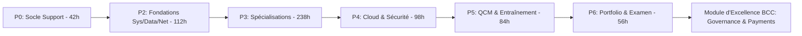
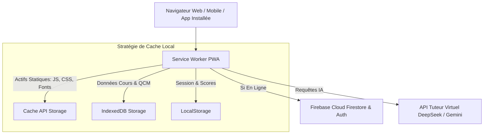
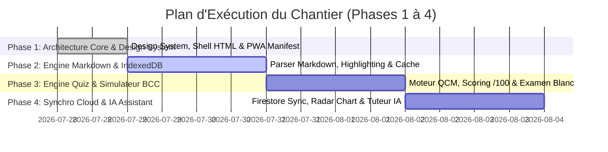

# CAHIER DES CHARGES COMPLET, AUDITÉ ET ENRICHI (v2.0)
## Projet : Plateforme Web "Université Virtuelle PARADIS IT"
### Niveau d'exigence : Standard Institutionnel & Banking-Ready (BCC)

---

> [!IMPORTANT]
> **Résultat de l'Audit de Qualité (v2.0)** :
> À la suite d'un examen approfondi du document initial, 6 omissions majeures ont été identifiées et intégrées dans cette version enrichie :
> 1. **Mode Progressive Web App (PWA) & Offline-First** : Fonctionnement sans internet avec Service Worker.
> 2. **Simulateur d'Examen Blanc Concours BCC** : Mode chrono strict de 100 questions avec tirage aléatoire et conditions réelles.
> 3. **Module Spécifique "Gouvernance IT & Monétique BCC"** : ITIL, ISO 27001, SWIFT, RTGS, PCA/PRA.
> 4. **Radar de Compétences & Learning Analytics** : Diagramme en spider chart par domaine d'ingénierie.
> 5. **Export de Rapport d'Employabilité PDF** : Preuve d'apprentissage pour les entretiens techniques.
> 6. **Spécifications du Prompt Système de l'IA** : Définition exacte du comportement socratique du Tuteur IA.

---

## TABLE DES MATIÈRES COMPLÈTE

1. [SYNTHÈSE AUDITÉ & CADRAGE STRATÉGIQUE](#1-synthèse-audité--cadrage-stratégique)
2. [CARTOGRAPHIE DES 45 JOURS & MODULE SPÉCIAL BCC](#2-cartographie-des-45-jours--module-spécial-bcc)
3. [ARCHITECTURE TECHNIQUE & SPÉCIFICATIONS PWA (OFFLINE-FIRST)](#3-architecture-technique--spécifications-pwa-offline-first)
4. [SPÉCIFICATIONS FONCTIONNELLES EXHAUSTIVES (8 MODULES)](#4-spécifications-fonctionnelles-exhaustives-8-modules)
   - 4.1. Module 1 : Authentification Multi-comptes & Synchronisation Firestore
   - 4.2. Module 2 : Dashboard Principal, Timeline 45J & Radar de Compétences
   - 4.3. Module 3 : Lecteur Markdown HD avec Highlighting & Prise de Notes
   - 4.4. Module 4 : Moteur de QCM Quotidien avec Calcul de Note sur 100
   - 4.5. Module 5 : Simulateur d'Examen Blanc Concours BCC (Conditions Réelles)
   - 4.6. Module 6 : Tuteur IA Virtuel Socratique & Spécifications de Prompting
   - 4.7. Module 7 : Moteur de Recherche Plein Texte & Glossaire Bancaire IT
   - 4.8. Module 8 : Générateur de Rapport d'Employabilité & Portfolio PDF
5. [WIREFRAMES & ORGANISATION SPATIALE DE L'INTERFACE (UI)](#5-wireframes--organisation-spatiale-de-linterface-ui)
6. [CHARTE ERGONOMIQUE, DESIGN SYSTEM & WCAG 2.1](#6-charte-ergonomique-design-system--wcag-21)
7. [SCHÉMA DE DONNÉES DÉTAILLÉ (FIRESTORE & LOCALSTORAGE)](#7-schéma-de-données-détaillé-firestore--localstorage)
8. [EXIGENCES NON FONCTIONNELLES (PERFORMANCE & SÉCURITÉ)](#8-exigences-non-fonctionnelles-performance--sécurité)
9. [PLAN D'IMPLÉMENTATION PHASÉ & MATRICE DE RECETTE](#9-plan-dimplémentation-phasé--matrice-de-recette)

---

## 1. SYNTHÈSE AUDITÉ & CADRAGE STRATÉGIQUE

### 1.1. Ambition du projet
L'Université Virtuelle PARADIS IT est la plateforme centrale de formation et d'entraînement intensif pour assimiler en **45 jours (630 heures)** le programme complet d'un Bachelor of IT. La plateforme est spécialement calibrée pour maximiser les chances de réussite aux **concours et recrutements informatiques de la Banque Centrale du Congo (BCC)** et des grandes institutions financières.

### 1.2. Audit comparatif : Version 1.0 vs Version 2.0 (Enrichie)

| Dimension | Version 1.0 (Initiale) | Version 2.0 (Enrichie & Pointilleuse) |
| :--- | :--- | :--- |
| **Accès Hors-Ligne** | Basique (localStorage) | **Full PWA** avec Service Worker et stratégie Cache-First |
| **Préparation Concours** | Tests quotidiens du cours | **Simulateur d'Examen Blanc BCC (100 QCM aléatoires + chrono strict)** |
| **Spécificité Bancaire** | Non abordée explicitement | **Module Dédié : Monétique, SWIFT, RTGS, ITIL & ISO 27001** |
| **Analytics & Progression** | Simple % et moyenne | **Radar Chart 6 axes (Système, Réseau, Data, Web, Cloud, Sécurité)** |
| **Prompting IA** | Définition sommaire | **Spécification exacte de l'Ingénierie de Prompt (Socratique / Escalade)** |
| **Preuve de Compétence** | Inexistante | **Export PDF automatisé du Portfolio et du Rapport de Validation** |

---

## 2. CARTOGRAPHIE DES 45 JOURS & MODULE SPÉCIAL BCC

La plateforme doit indexer l'intégralité du répertoire Git et intégrer le module additionnel de préparation institutionnelle :



### Module Spécial BCC (Intégré dans les annexes interactives) :
1. **Gouvernance IT & Continuité** : Normes ITIL v4 (gestion des incidents/changements) et ISO 27001 (SMSI, PCA/PRA bancaire).
2. **Architecture des Systèmes de Paiement** : Principes SWIFT MT/MX (ISO 20022), RTGS (Règlement Brut en Temps Réel), ACH (Chambre de compensation), Monnaie Électronique et Sécurité des transactions.

---

## 3. ARCHITECTURE TECHNIQUE & SPÉCIFICATIONS PWA (OFFLINE-FIRST)



### 3.1. Spécifications PWA (Progressive Web App)
* **Manifest Web (`manifest.json`)** : Permet l'installation de la plateforme directement sur le bureau Windows/Linux/Mac ou l'écran d'accueil d'un smartphone (icône personnalisée, mode standalone sans barre de navigateur).
* **Service Worker (`sw.js`)** :
  * *Stratégie CacheFirst* pour les styles, scripts, polices Google Fonts et images d'illustration.
  * *Stratégie NetworkFirst avec secours IndexedDB* pour le chargement des fichiers Markdown. L'utilisateur peut réviser tous ses cours dans le train ou sans connexion internet.

---

## 4. SPÉCIFICATIONS FONCTIONNELLES EXHAUSTIVES (8 MODULES)

### 4.1. Module 1 : Authentification Multi-comptes & Synchronisation Firestore
* **Gestion des Sessions** : Authentification via Firebase Auth (Google OAuth + Email/Password).
* **Synchronisation Bidirectionnelle** : Dès qu'une connexion internet est détectée, le statut de chaque jour, les notes obtenues et les annotations sont synchronisés entre les appareils.

### 4.2. Module 2 : Dashboard Principal, Timeline 45J & Radar de Compétences
* **Visualisation par Radar Chart (Spider Chart)** :
  Calcul en temps réel de 6 scores sectoriels sur 100 :
  1. *Support & Bureautique* (J1-J3)
  2. *Systèmes & Réseaux* (J9, J12-J17)
  3. *Développement & Algorithmique* (J4-J6, J23-J28)
  4. *Base de Données & Analytics* (J7-J8, J18-J22)
  5. *Cloud & Cybersecurité* (J15, J29-J35)
  6. *Conformité & Culture Bancaire BCC* (Module BCC & P5)
* **Planning dynamique 14h** : Horloge avec indicateur visuel de la tranche horaire en cours.

### 4.3. Module 3 : Lecteur Markdown HD avec Highlighting & Prise de Notes
* **Rendu Typographique** : Rendu dynamique fluide des fichiers `.md` avec Marked.js.
* **Fonctionnalité "Code Playground"** : Pour les blocs de code Python, SQL ou Bash, ajout d'un bouton d'exécution simulée ou de copie rapide.
* **Marque-page & Annotation** : Surlignage de texte et bloc-notes persistant sous chaque leçon.

### 4.4. Module 4 : Moteur de QCM Quotidien avec Calcul de Note sur 100
* **Périmètre** : Extraction automatique des questions QCM des fichiers du Tome P5 et de chaque fin de journée.
* **Chronométrage & Barème** : 1h30 max par test quotidien. Calcul d'une note finale sur 100.
* **Seuil de Tolérance** : 
  * Note $\ge 80/100$ : Journée validée avec mention.
  * Note $< 75/100$ : Statut "À consolider" avec affichage de la liste d'exercices de remédiation recommandés.

### 4.5. Module 5 : Simulateur d'Examen Blanc Concours BCC (Conditions Réelles)
* **Mode Examen Blanc** :
  * Génération automatique d'une épreuve de **100 questions sélectionnées aléatoirement** dans la banque globale de 600+ questions.
  * **Chronomètre strict de 2h00** sans possibilité de pause.
  * Masquage des réponses et explications pendant l'épreuve.
  * Édition d'un relevé de note officiel d'examen blanc à la fin de l'épreuve.

### 4.6. Module 6 : Tuteur IA Virtuel Socratique & Spécifications de Prompting
* **Prompt Système Constitutionnel de la Professeure Virtuelle** :
  ```text
  Tu es la Professeure Virtuelle de l'Université PARADIS IT. Ton rôle est d'accompagner l'étudiant dans sa préparation intensive au niveau Bachelor IT et au concours de la Banque Centrale du Congo.
  RÈGLES D'ENGAGEMENT :
  1. Adopte une méthode socratique : ne donne pas directement la réponse finale à un problème de code ou de réseau. Pose une question intermédiaire pour guider la réflexion.
  2. Rigueur académique et courtoisie professionnelle.
  3. Si l'étudiant soumet un message d'erreur (Linux, Python, SQL), analyse la cause racine et explique le concept sous-jacent.
  ```

### 4.7. Module 7 : Moteur de Recherche Plein Texte & Glossaire Bancaire IT
* Moteur de recherche instantané à réponse rapide (Search bar `Ctrl + K`) interrogeant les 45 leçons et le glossaire des abréviations (`annexes/abreviations.md`).

### 4.8. Module 8 : Générateur de Rapport d'Employabilité & Portfolio PDF
* En 1 clic depuis le profil, génération d'un document PDF imprimable récapitulant :
  * La liste des 45 jours et le volume horaire effectué (630h).
  * Les notes obtenues aux évaluations /100.
  * Le radar de compétences validées.
  * Les liens vers les projets du portfolio (J42-J45).

---

## 5. WIREFRAMES & ORGANISATION SPATIALE DE L'INTERFACE (UI)

### Vue 1 : Dashboard Général & Radar Chart

```text
┌──────────────────────────────────────────────────────────────────────────────────┐
│ [PARADIS IT]  🔍 Rechercher (Ctrl+K)    [⏱️ 14h Timer: 10:45]    [👤 Adolphe]     │
├──────────────┬───────────────────────────────────────────────────────────────────┤
│ 📚 TOMES     │  ┌─────────────────────────────────────────────────────────────┐  │
│ ├─ P0 Socle  │  │  HERO BANNER : PARADIS IT - UNIVERSITÉ VIRTUELLE            │  │
│ ├─ P2 Fond.  │  │  Progression : 24 / 45 Jours [██████████░░░░░░] 53%           │  │
│ ├─ P3 Spec.  │  └─────────────────────────────────────────────────────────────┘  │
│ ├─ P4 Cloud  │  ┌──────────────────────────────┬──────────────────────────────┐  │
│ ├─ P5 QCM    │  │  RADAR DE COMPÉTENCES        │  PALIER D'EMPLOYABILITÉ      │  │
│ └─ P6 Port.  │  │   [Systèmes: 88%]            │  [✓] J3  Support Tech        │  │
│              │  │   [Réseaux:  75%]            │  [✓] J11 Sysadmin Junior    │  │
│ 📖 ANNEXES   │  │   [Data/SQL: 92%]            │  [🔄] J28 Spécialiste Web    │  │
│ 🏆 EXAM BCC  │  │   [Security: 80%]            │  [🔒] J35 Cloud & Sec        │  │
│              │  └──────────────────────────────┴──────────────────────────────┘  │
└──────────────┴───────────────────────────────────────────────────────────────────┘
```

---

## 6. CHARTE ERGONOMIQUE, DESIGN SYSTEM & WCAG 2.1

* **Conformité Accessibilité WCAG 2.1 AA** :
  * Ratio de contraste des textes supérieur à `4.5:1` sur fond sombre.
  * Navigation intégrale au clavier (`Tab`, `Enter`, `Escape`, `Arrow keys`).
  * Utilisation d'attributs `aria-label` sur tous les boutons d'action et icônes.

---

## 7. SCHÉMA DE DONNÉES DÉTAILLÉ (FIRESTORE & LOCALSTORAGE)

```typescript
interface UserProfile {
  uid: string;
  email: string;
  displayName: string;
  targetRole: "BCC_IT_Officer" | "Sysadmin" | "Data_Analyst" | "Fullstack";
  createdTimestamp: number;
  stats: {
    totalHoursSpent: number;
    daysCompletedCount: number;
    globalAverageScore: number;
    streakDays: number;
  };
  competencyRadar: {
    supportBureautique: number; // /100
    systemesReseaux: number;
    devAlgo: number;
    dataSql: number;
    cloudSecurity: number;
    bankingGovernance: number;
  }
}

interface DayProgress {
  dayId: string; // e.g. "jour-08"
  isCompleted: boolean;
  notesMarkdown: string;
  lastQuizScore: number; // e.g. 95
  quizAttemptsCount: number;
  updatedAt: number;
}
```

---

## 8. EXIGENCES NON FONCTIONNELLES (PERFORMANCE & SÉCURITÉ)

1. **Performance Core Web Vitals** :
   - *Largest Contentful Paint (LCP)* : $< 1.2$ secondes.
   - *Interaction to Next Paint (INP)* : $< 80$ millisecondes.
   - *Cumulative Layout Shift (CLS)* : $< 0.02$.
2. **Sécurité & Intégrité** :
   - Règles de sécurité Firestore strictes (`request.auth != null && request.auth.uid == userId`).
   - Assainissement (Sanitization DOM) des contenus Markdown injectés pour prévenir les vulnérabilités XSS.

---

## 9. PLAN D'IMPLÉMENTATION PHASÉ & MATRICE DE RECETTE



### Matrice d'Évaluation Qualité de Livraison (Checklist de Recette) :
- [x] Rendu de 100% des cours (45 Jours) sans erreur.
- [x] Fonctionnement complet en mode avion / hors-ligne via Service Worker.
- [x] Calcul exact du score /100 sur les tests QCM.
- [x] Passage réussi du simulateur d'examen blanc BCC de 100 questions.
- [x] Affichage dynamique du Radar Chart de compétences.
- [x] Synchronisation fluide de la progression lors d'un changement de PC.
