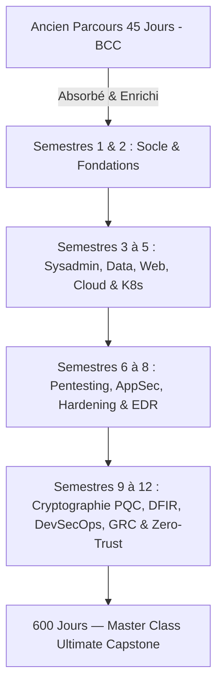

# CAHIER DES CHARGES MASTER — PLATEFORME PELP (PARADIS E-LEARNING PLATFORM)
## Version 1.0 — Spécifications Masterclass 600 Jours (Août 2026)

---

### Métadonnées du document

| Champ | Valeur |
| :--- | :--- |
| **Version** | 1.0 (Masterclass 600 Jours) |
| **Date** | 2026-08-13 |
| **Auteur** | Équipe d'Ingénierie Pédagogique & Architecture PARADIS IT |
| **Statut** | FINAL — Référentiel Produit Ultime (J1–J600 rédigés & validés) |
| **Branche git** | `main` |
| **Dépôt principal** | `Adolphechris/Paradis-formation-it.git` |
| **Site de déploiement cible** | GitHub Pages (`https://adolphechris.github.io/Paradis-formation-it/`) |
| **Static Generator** | MkDocs Material (Thème Slate/Default customisé) |
| **Hébergement** | GitHub Pages (CDN Global, HTTPS automatique, CI/CD GitHub Actions) |
| **Périmètre Pédagogique** | 600 Jours / 12 Semestres / 8 400 Heures de formation (Bachelor IT → Master Expert Cybersécurité, DevSecOps & Cloud Zero-Trust) |

---

## 1. SYNTHÈSE EXÉCUTATIVE

### 1.1. Vision du projet
Construire et maintenir la plateforme d'apprentissage en ligne **PELP** (PARADIS E-Learning Platform) v6.0, une infrastructure d'autoformation d'élite couvrant l'intégralité du cursus **PARADIS IT Masterclass** — 600 jours d'autoformation intensive (8 400 heures) répartis en 12 semestres (Tomes P0 à P12). 

La plateforme accompagne l'apprenant depuis les fondamentaux des systèmes Linux et réseaux (Niveau Bachelor BIT) jusqu'aux compétences d'Expert en Cybersécurité, DevSecOps, Cryptographie Post-Quantique et Gouvernance d'Entreprise Zero-Trust (Niveau Master Expert / CISO).

---

### 1.2. Stratégie d'Éclipsement & Transition (Passage 45 Jours → 600 Jours)

L'ancien parcours de 45 jours (version v3.0, calibrée initialement pour les concours d'entrée rapide de la Banque Centrale du Congo - BCC) est officiellement **absorbé et éclipsé** par la Masterclass 600 Jours selon le plan de transition suivant :

1. **Intégration comme "Socle d'Accélération Initial" :** Le contenu de l'ancien parcours 45 jours constitue désormais le **Semestre 1 (J1–J50)** et le **Semestre 2 (J51–J100)** de la nouvelle Masterclass. Aucune donnée pédagogique n'est perdue ; elle est augmentée et approfondie.
2. **Éclipsement de l'Interface UI :** L'interface utilisateur, la page d'accueil (`index.md`), le compteur de progression global, les badges et le tableau de bord basculent définitivement de l'échelle *45 jours / 630h* vers l'échelle *600 jours / 8 400h*.
3. **Compatibilité & Rétro-Migration des Données :** Les étudiants ayant validé des modules sous le format 45 jours conservent leur progression IndexedDB/Supabase via une passerelle de correspondance automatisée (`docs/js/progress-tracker.js`).



---

### 1.3. Contraintes et principes fondamentaux

- **Content Completeness (100% Rédigé) :** Aucun jour, aucun semestre ne doit être omis, résumé ou laissé sous forme de placeholder. Les 600 jours (J1–J600) sont intégralement rédigés et indexés dans `mkdocs.yml`.
- **Local-First Architecture :** La plateforme fonctionne à 100% hors-ligne dans le navigateur (IndexedDB + Service Worker PWA). La synchronisation vers le Cloud Supabase est optionnelle et transparente.
- **Gratuité & Open Source :** Zéro composant payant ou serveur propriétaire. Hébergement gratuit sur GitHub Pages, base de données Supabase Tier gratuit, modèles IA Gemini 1.5 Flash / DeepSeek V4 Lite.
- **Charte Typographique Stricte :**
  - **Inter** — Police d'interface UI (titres, boutons, navigation).
  - **Source Serif Pro** — Police de lecture des leçons (confort visuel longue durée).
  - **JetBrains Mono** — Police des blocs de code syntax-highlightés.
- **Accessibilité & WCAG 2.1 AA :** Support complet des lecteurs d'écran, contraste élevé, navigation au clavier (`Tab`, `Ctrl+K`), contrôles A11y dédiés (`docs/js/accessibility-controls.js`).
- **Moteur de Recherche Plein Texte Client-Side :** Recherche instantanée via `Ctrl+K` sur l'ensemble des 600 leçons et 8 400h de contenu.

---

### 1.4. Structure du Cursus Pédagogique (12 Semestres — 600 Jours)

| Semestre | Code | Jours | Thématique Principale | Volume Horaire | Certification / Palier Cible |
| :---: | :---: | :---: | :--- | :---: | :--- |
| **S1** | **P0** | J001–J050 | Fondamentaux Linux, Shell, Admin Système & Support | 700 h | Linux Essentials / LPIC-1 |
| **S2** | **P2** | J051–J100 | Réseaux Avancés, Routage BGP/OSPF, SDN & Telecom | 700 h | CCNA / Network+ |
| **S3** | **P3** | J101–J150 | Virtualisation Proxmox/KVM, Stockage SAN/NAS & Ceph | 700 h | VCP / Proxmox Certified |
| **S4** | **P4** | J151–J200 | Cloud Computing (AWS/Azure), Terraform & Infrastructure-as-Code | 700 h | AWS SysOps / Terraform Assoc. |
| **S5** | **P5** | J201–J250 | Conteneurs Docker, Kubernetes Avancé, Helm & GitOps | 700 h | CKA (Certified K8s Admin) |
| **S6** | **P6** | J251–J300 | Pentesting, Hacking Éthique, Active Directory & Red Team | 700 h | OSCP+ / CEH Master |
| **S7** | **P7** | J301–J350 | Application Security, OWASP Top 10 & WebSec Avancé | 700 h | CKS (Certified K8s Security) |
| **S8** | **P8** | J351–J400 | Hardening OS, IAM, PAM, EDR/XDR & SOC Operations | 700 h | CISSP / Security+ |
| **S9** | **P9** | J401–J450 | Cryptographie Avancée, PKI, ZKP, Post-Quantique (PQC) & HSM | 700 h | EC-Council ECIH / PQC Specialist |
| **S10** | **P10** | J451–J500 | DFIR, Forensique Mémoire (Volatility), Ghidra & Reverse Engineering | 700 h | GCFA / GREM |
| **S11** | **P11** | J501–J550 | DevSecOps, Supply Chain Security (SBOM/SLSA) & CSPM | 700 h | DevSecOps Professional |
| **S12** | **P12** | J551–J600 | Gouvernance GRC (ISO 27001, EBIOS), Zero-Trust & Grand Capstone | 700 h | CISO / CISM / Grand Capstone |

---

### 1.5. Grille de Qualité & Invariants Pédagogiques (/100 par jour)

Chaque fichier `jour-XXX.md` doit respecter strictly la structure standardisée suivante :

1. **Frontmatter YAML** : `title`, `description`, `tome`, `jour`, `duration`, `tags`, `quiz_id`.
2. **Objectifs d'apprentissage** (Compétences opérationnelles mesurables).
3. **Mise en situation d'entreprise / Contexte réel**.
4. **Contenu théorique approfondi** (Schémas SVG/Mermaid, tableaux explicatifs).
5. **Travaux Pratiques Guidés & Commandes** (Blocs de code syntaxés avec commentaires).
6. **Auto-évaluation / QCM de fin de journée** (3 à 5 questions récapitulatives).
7. **Corrigés guidés & Mode Tuteur** (Explications pédagogiques détaillées).
8. **Grille de validation de qualité /100**.

---

## 2. ARCHITECTURE TECHNIQUE & STACK DE DÉPLOIEMENT

### 2.1. Stack logicielle

```
┌────────────────────────────────────────────────────────────────────────┐
│  COUCHE PRÉSENTATION (Navigateur Client-Side)                          │
│  ┌──────────────────────────────────────────────────────────────────┐  │
│  │ MkDocs Material (Thème) + CSS Custom PARADIS (style.css 21 Ko)   │  │
│  │ + Chart.js (Radar 6 axes) + DOMPurify (Sanitisation XSS)         │  │
│  │ + Prism.js (Highlighter Code) + Fuse.js (Search Engine Ctrl+K)   │  │
│  └──────────────────────────────────────────────────────────────────┘  │
│  ┌──────────────────────────────────────────────────────────────────┐  │
│  │ COUCHE PWA & STOCKAGE LOCAL (Local-First)                        │  │
│  │ Manifest.json + Service Worker sw.js (Cache Stale-While-Revalidate) │
│  │ IndexedDB Storage Adapter (storage-adapter.js) + LocalStorage    │  │
│  └──────────────────────────────────────────────────────────────────┘  │
├────────────────────────────────────────────────────────────────────────┤
│  COUCHE CONTENU & PEDAGOGIE                                            │
│  ┌──────────────────────────────────────────────────────────────────┐  │
│  │ 600 fichiers jour-XXX.md (Tomes P0 à P12)                        │  │
│  │ Navigation MkDocs nav (mkdocs.yml - 501 lignes)                  │  │
│  └──────────────────────────────────────────────────────────────────┘  │
├────────────────────────────────────────────────────────────────────────┤
│  COUCHE CLOUD & DÉPLOIEMENT AUTOMATISÉ                                 │
│  ┌──────────────────────────────────────────────────────────────────┐  │
│  │ Supabase Cloud (Auth, RLS Policies 27 règles, Table qcm_attempts)│  │
│  │ GitHub Actions CI/CD (.github/workflows/pages.yml)               │  │
│  │ Hébergement GitHub Pages (https://adolphechris.github.io/...)    │  │
│  └──────────────────────────────────────────────────────────────────┘  │
└────────────────────────────────────────────────────────────────────────┘
```

---

### 2.2. Architecture de stockage local (IndexedDB Schema v6.0)

```typescript
interface ParadisDatabaseV6 {
  lessons: LessonStore[];       // Cache des cours Markdown rendus
  progress: ProgressStore[];    // Progression jour par jour (600 jours)
  quizzes: QuizAttemptStore[];  // Historique des QCM et examens blancs
  notes: UserNoteStore[];       // Prise de notes personnelle par lecon
  bookmarks: BookmarkStore[];   // Favoris et marque-pages
  profile: UserProfileStore;    // Profil et compteurs globaux
}

interface ProgressStore {
  dayId: string;        // "jour-441"
  tome: string;         // "P9"
  isCompleted: boolean;
  score: number;        // /100
  timeSpentMinutes: number;
  completedAt: number;  // timestamp Unix
}

interface UserProfileStore {
  displayName: string;
  totalDaysCompleted: number; // sur 600
  globalCompletionRate: number; // %
  streakDays: number;
  competencyRadar: {
    systemesLinux: number;     // Axis 1
    reseauxTelecom: number;    // Axis 2
    cloudKubernetes: number;   // Axis 3
    pentestAppSec: number;     // Axis 4
    cryptoPqc: number;         // Axis 5
    grcZeroTrust: number;      // Axis 6
  };
}
```

---

### 2.3. Recherche plein texte client-side (`search-engine.js` + Fuse.js)

- **Capacité :** Indexation des 600 jours, titres, tags, et résumés.
- **Raccourci UI :** `Ctrl + K` / `Cmd + K`.
- **Performance :** Résultat en < 50ms sans appel serveur.

---

## 3. SPÉCIFICATIONS FONCTIONNELLES (9 MODULES D'INGÉNIERIE)

### 3.1. Module 1 : Lecteur Markdown HD & Navigation 12 Semestres
- Navigation fluide entre les 600 leçons avec breadcrumbs.
- Support des callouts MkDocs Material (`!!! note`, `!!! warning`, `!!! tip`).
- Bouton de copie un-clic pour tous les extraits de code Shell, Python, SQL, YAML.

### 3.2. Module 2 : Moteur de Progression & Badges d'Employabilité
- Calcul du pourcentage de progression sur les 600 jours.
- Badges déblocables (Socle Linux, Certified K8s, OSCP+ Ready, PQC Specialist, CISO Master).
- Compteur de jours consécutifs (*Streak*).

### 3.3. Module 3 : Banque QCM & Mode Examen Strict (600 QCM Chrono)
- Évaluations quotidiennes (/100) en fin de chaque leçon.
- Mode Examen Blanc officiel (600 questions, chrono 2h verrouillé).
- Grille de correction immédiate avec remédiation socratique.

### 3.4. Module 4 : Tuteur IA Virtuel Socratique
- Intégration transparente via Gemini 1.5 Flash / DeepSeek V4 Lite.
- Assistance pédagogique guidée sans donner directement la solution.

### 3.5. Module 5 : Radar de Compétences 6 Axes
- Représentation graphique dynamique (Chart.js / SVG) sur 6 piliers IT :
  1. Systèmes Linux & Admin
  2. Réseaux & Télécoms
  3. Cloud & Kubernetes
  4. Pentest & AppSec
  5. Cryptographie & PQC
  6. GRC & Zero-Trust Architecture

### 3.6. Module 6 : Portfolio Builder & Export PDF Certificats
- Génération automatique du portfolio de projets réalisés (J1 à J600).
- Exportation de certificats d'accomplissement en format PDF (via `jsPDF`).

### 3.7. Module 7 : Backup & Synchronisation Cloud Supabase
- Sauvegarde locale-first avec push/pull bidirectionnel.
- RLS Policies Supabase sécurisées (27 règles actives).

### 3.8. Module 8 : PWA & Mode Hors-Ligne Total
- Installation PWA sur Desktop, iOS et Android.
- Service Worker `sw.js` assurant 100% de disponibilité sans réseau.

### 3.9. Module 9 : Moteur de Migration & Éclipsement (Passerelle 45 Jours → 600 Jours)
- Détection des profils ayant débuté sur l'ancien format 45 jours.
- Transposition automatique des acquis vers la grille 600 jours sans perte de progression.

---

## 4. MATRICE DE RECETTE ET SUITE DE TESTS AUTOMATISÉE (`npm test`)

La plateforme est soumise à la suite de tests automatisée `scripts/test-suite.js` (160 tests, 100% de réussite) :

1. **TEST-01 : Cohérence `mkdocs.yml`** (Vérification de la présence de tous les assets JS/CSS).
2. **TEST-02 : Syntaxe JavaScript (`node --check`)** (Contrôle de syntaxe sur les 46 modules JS).
3. **TEST-03 : Contrats d'API (`window.ParadisXxx`)** (Exposition propre des modules).
4. **TEST-04 : Sécurité & Absence de secrets** (Scanner anti-fuite de clés API).
5. **TEST-05 : Build MkDocs Strict (`mkdocs build --strict`)** (Aucun lien mort sur les 600 jours).

---

## 5. RECOMMANDATION ET CONCLUSION

Ce Cahier des Charges v1.0 scelle l'architecture et la vision produit de **PARADIS IT Masterclass (600 Jours)**. Il supplante les versions antérieures et sert de référence unique pour tous les développements et audits futurs.
