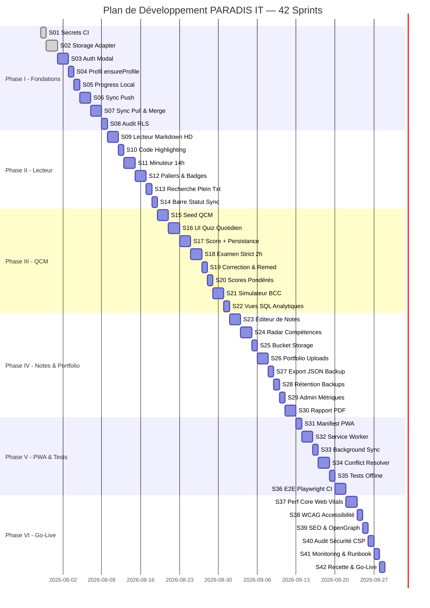

# PLAN DE DÉVELOPPEMENT MASTER — VERSION ENRICHIE ET DÉFINITIVE
## Plateforme : PARADIS E-Learning Platform (PELP)
## 42 Sprints Granulaires — 6 Phases Successives

---

> [!IMPORTANT]
> **Principes Fondateurs & Non-Négociables**
> Ce plan est le **document de référence d'exécution du chantier**. Il ne peut pas être contourné, réordonné ou bâclé. Chaque sprint est une unité atomique de travail validée par Pull Request avant de passer au suivant.
>
> **Piliers techniques immuables :**
> - **Frontend** : MkDocs Material ou Docusaurus, HTML5 sémantique, JS ES6+ modulaire, CSS Obsidian Dark Mode.
> - **Backend** : Supabase exclusivement (PostgreSQL 17, Auth, RLS strict, Storage).
> - **Local-First** : IndexedDB via `idb` + Service Worker PWA en fallback hors-ligne.
> - **Déploiement** : GitHub Pages (CI/CD via GitHub Actions, zéro coût).
> - **Sécurité** : Aucun secret commité. GitHub Secrets uniquement. RLS activé sur toutes les tables.
> - **Objectif métier** : Réussir les épreuves de recrutement de la Banque Centrale du Congo (BCC).

---

## AVANT-PROPOS : ANALYSE DES LACUNES DU PLAN INITIAL (30 SPRINTS)

L'analyse critique du plan initial en 30 sprints a révélé les lacunes suivantes, corrigées dans cette version définitive :

| Lacune identifiée | Correction apportée dans v42 |
| :--- | :--- |
| Les sprints 01-10 mélangent infra + UX dans de gros blocs | Chaque sprint est désormais **atomique** (1 livrable = 1 PR) |
| Pas de sprint dédié au stockage `IndexedDB` | **Sprint 02 dédié** au Storage Adapter local-first |
| Pas de sprint pour le lecteur de cours Markdown | **Sprints 09-10** dédiés au rendu HD des leçons |
| Pas de sprint pour le timer 14h/jour quotidien | **Sprint 11** dédié au Minuteur 14h |
| Pas de sprint pour les paliers d'employabilité | **Sprint 12** dédié aux badges métiers (J3, J11, J28, J35, J45) |
| Module BCC inexistant dans le plan initial | **Sprint 21** dédié à l'Épreuve Simulateur Concours BCC |
| Pas de radar de compétences 6 axes | **Sprint 24** dédié au Spider Chart de progression |
| Pas de gestion de la palette Supabase Storage pour le portfolio | **Sprints 25-26** dédiés |
| Pas de certificat/rapport PDF d'employabilité | **Sprint 30** dédié |
| PWA et Service Worker non planifiés | **Sprints 31-33** dédiés |
| Résolution de conflits multi-appareils non détaillée | **Sprint 34** dédié avec algorithme 3-Way Merge |
| Accessibilité WCAG non prévue | **Sprint 38** dédié |
| Runbook d'exploitation absent | **Sprint 41** dédié |

---

## ORGANISATION GÉNÉRALE ET CHARTE DE GOUVERNANCE

### Règles de Branching & PR
```
main (branche protégée, déployée sur GitHub Pages)
  └── feature/sprint-01
  └── feature/sprint-02
  └── ...
  └── feature/sprint-42
```

- Chaque sprint commence par la création d'une branche `feature/sprint-XX` depuis `main`.
- La fusion sur `main` est conditionnée à la **validation de TOUS les critères d'acceptation** du sprint.
- Un sprint refusé en QA est retourné à l'état `in-progress` sur sa branche. On ne passe jamais au sprint suivant avec un sprint cassé.

### Rôles
| Rôle | Responsabilité |
| :--- | :--- |
| **AI (Antigravity)** | Scaffolding, rédaction du code, PR drafts, migrations SQL, tests unitaires |
| **Kilo (QA & Validation)** | Contrôle de qualité sur chaque PR, tests manuels, revue d'architecture |
| **Adolphe (Commanditaire)** | Validation métier, vérification de l'alignement pédagogique BCC, recette finale |

### Template de Livraison Standard (chaque sprint)
Chaque PR doit obligatoirement fournir :
1. **Code ou migration** (ou les deux) ciblé et non-polluant.
2. **Changelog d'une ligne** : *"Sprint XX — [Objectif résumé en une phrase]"*.
3. **Instructions de test manuel** : Suite de pas reproduisibles pour valider le critère d'acceptation.
4. **Un test automatisé minimum** (unitaire, SQL, ou Playwright selon le sprint).
5. **Capture d'écran ou log** prouvant que le livrable fonctionne.

---

## PHASE I — INFRASTRUCTURE, AUTHENTIFICATION & SYNCHRONISATION DE BASE
**Durée estimée : 12 à 16 jours ouvrés | Sprints 01 à 08**

> [!NOTE]
> Cette phase est le socle sur lequel tout repose. Elle doit être irréprochable avant de développer quoi que ce soit en front-end ou en pédagogie. Un défaut ici aura des répercussions sur les 34 sprints suivants.

---

### Sprint 01 — Injection des Secrets CI & Vérification de Conformité Runtime
**Priorité : CRITIQUE | Durée estimée : 1 jour**

**Contexte** : Les clés Supabase (`SUPABASE_URL`, `SUPABASE_ANON_KEY`) ne doivent jamais apparaître dans le dépôt. Le fichier `supabase-config.js` est actuellement commité avec des valeurs en dur ou vides. Ce sprint corrige cela définitivement.

**Tâches détaillées** :
1. Créer le fichier template `.env.example` à la racine avec les noms de variables uniquement (sans valeurs).
2. Modifier `.gitignore` pour exclure `.env`, `supabase-config.js` et tout fichier `.local.js`.
3. Mettre à jour `.github/workflows/deploy.yml` :
   - Lire `SUPABASE_URL` et `SUPABASE_ANON_KEY` depuis les GitHub Secrets du dépôt.
   - Générer dynamiquement le fichier `site/js/supabase-config.js` au moment du build CI.
4. Ajouter un contrôle de garde (`guard clause`) dans `supabase-client.js` : si les clés sont vides/nulles, afficher un message d'erreur clair (jamais un crash silencieux).
5. Documenter la procédure dans `README.md` (section "Déployer en production").

**Critères d'acceptation** :
- `git grep -r "SUPABASE"` ne retourne aucune clé de valeur réelle dans le dépôt.
- Le build CI sur la branche `feature/sprint-01` réussit avec les secrets injectés.
- Un build sans secrets échoue avec un message d'erreur explicite (et non une page blanche silencieuse).

**Dépendances** : Aucune.

**Livrable** : PR de workflow CI + `.env.example` + documentation.

---

### Sprint 02 — Mise en Place du Storage Adapter Local-First (IndexedDB)
**Priorité : CRITIQUE | Durée estimée : 2 jours**

**Contexte** : Toute la logique de persistance doit passer par une couche d'abstraction unique (`storage-adapter.js`). Cette couche permet d'échanger le backend (IndexedDB ↔ Supabase) sans toucher au code métier. C'est le cœur de l'architecture local-first.

**Tâches détaillées** :
1. Créer `site/js/storage-adapter.js` avec la librairie `idb` en dépendance.
2. Initialiser les objectStores IndexedDB : `progress`, `notes`, `quiz_attempts`, `sync_queue`, `user_profile`.
3. Implémenter les méthodes d'interface uniformes :
   - `saveLocal(store, key, data)` → Écriture atomique.
   - `getLocal(store, key)` → Lecture par identifiant.
   - `getAllLocal(store)` → Lecture complète d'un store.
   - `deleteLocal(store, key)` → Suppression.
   - `enqueueSync(operation)` → Ajout d'une opération en file d'attente de synchronisation.
4. Écrire les tests unitaires Jest couvrant chaque méthode.

**Critères d'acceptation** :
- Une progression peut être écrite et relue dans IndexedDB sans passer par internet.
- La file d'attente `sync_queue` enregistre bien les opérations en attente.
- Tests unitaires : 100% de couverture sur le module.

**Dépendances** : Sprint 01 (CI opérationnel).

**Livrable** : Module `storage-adapter.js` + Tests unitaires.

---

### Sprint 03 — Modal d'Authentification (Inscription & Connexion Supabase Auth)
**Priorité : HAUTE | Durée estimée : 2 jours**

**Contexte** : L'utilisateur doit pouvoir créer un compte et se connecter depuis n'importe quel PC pour retrouver sa progression. L'interface doit être élégante et non-intrusive (modal Glassmorphism, pas une page séparée).

**Tâches détaillées** :
1. Créer la modal HTML/CSS (`auth-modal`) avec deux onglets : *Connexion* et *Inscription*.
2. Implémenter `ParadisAuth.signUp(email, password, displayName)` et `ParadisAuth.signIn(email, password)`.
3. Gérer les états d'erreur explicites :
   - Email déjà utilisé → message clair.
   - Mot de passe trop court (< 8 caractères) → validation inline avant envoi.
   - Réseau indisponible → mode "invité local" proposé.
4. Persister la session utilisateur dans `localStorage` (token JWT Supabase) pour la reconnexion automatique.
5. Afficher dans la navbar : état "Connecté en tant que [prénom]" ou bouton "Se connecter".

**Critères d'acceptation** :
- Un nouvel utilisateur peut créer un compte en moins de 60 secondes.
- La session est toujours active au rechargement de la page.
- En cas d'erreur réseau, la modal propose de continuer en mode invité local.

**Dépendances** : Sprints 01 et 02.

**Livrable** : Composant `auth-modal.js` + CSS modal + Tests manuels documentés.

---

### Sprint 04 — Widget de Profil & Fonction `ensureProfile`
**Priorité : HAUTE | Durée estimée : 1 jour**

**Contexte** : Après la première connexion, un profil doit être créé dans `public.profiles`. Cette opération doit être idempotente (si le profil existe déjà, on le met à jour, on ne duplique pas).

**Tâches détaillées** :
1. Implémenter `ParadisSupabase.ensureProfile(userId, email, displayName)` avec logique `upsert`.
2. Déclencher `ensureProfile` dans le callback de connexion réussie de Supabase Auth.
3. Créer le widget mini-profil dans le header de la plateforme (nom, avatar généré par initiales si pas de photo).
4. Permettre la modification du `display_name` depuis les paramètres utilisateur (un simple champ texte).

**Critères d'acceptation** :
- Une ligne apparaît bien dans `public.profiles` dans la console Supabase après la première connexion.
- Le widget affiche le bon prénom dans la barre de navigation.
- Appeler `ensureProfile` deux fois de suite ne crée pas de doublon.

**Dépendances** : Sprint 03.

**Livrable** : Widget header profil + intégration `upsert` Supabase.

---

### Sprint 05 — Marquage d'une Journée Complétée (Mode Hors-Ligne)
**Priorité : HAUTE | Durée estimée : 1 jour**

**Contexte** : C'est la fonctionnalité la plus utilisée de toute la plateforme. L'apprenant doit pouvoir valider sa journée, même sans connexion internet, et la retrouver validée au prochain chargement.

**Tâches détaillées** :
1. Ajouter le bouton "✅ Marquer ce jour comme terminé" en bas de chaque page de leçon.
2. Au clic : appeler `ParadisProgress.saveProgress(dayId, tomeId, score)`.
3. Dans `saveProgress` : écrire dans IndexedDB avec `{synced: false, completedAt: timestamp}`.
4. Afficher l'indicateur d'état : "💾 Enregistré localement" avec animation de confirmation.
5. Au rechargement : lire IndexedDB et cocher automatiquement les jours déjà validés dans la sidebar.

**Critères d'acceptation** :
- En mode avion (Wi-Fi désactivé), le jour reste coché après rechargement de la page.
- La sidebar reflète fidèlement tous les jours complétés lus depuis IndexedDB.

**Dépendances** : Sprint 02.

**Livrable** : Module `progress-tracker.js` + Bouton de validation UI + Persistance IndexedDB.

---

### Sprint 06 — Bridge de Synchronisation Push (Local ➔ Supabase)
**Priorité : HAUTE | Durée estimée : 2 jours**

**Contexte** : Quand le réseau revient, toutes les actions effectuées hors-ligne doivent être transmises automatiquement à Supabase sans que l'utilisateur ait à faire quoi que ce soit.

**Tâches détaillées** :
1. Créer `site/js/sync-bridge.js` avec un écouteur sur `window.addEventListener('online', ...)`.
2. Au déclenchement : lire la file `sync_queue` de IndexedDB.
3. Pour chaque entrée en attente : exécuter l'opération correspondante sur Supabase (upsert dans `public.progress`).
4. En cas d'échec réseau persistant : retry avec backoff exponentiel (1s → 2s → 4s → 8s, max 5 tentatives).
5. Marquer les entrées comme `synced: true` dans IndexedDB après chaque succès.
6. Mettre à jour l'indicateur UI : "☁️ Synchronisé il y a [X secondes]".

**Critères d'acceptation** :
- Après avoir travaillé hors-ligne, au retour du réseau, les données apparaissent dans Supabase dans les 5 secondes.
- En cas d'erreur Supabase, l'interface affiche "⚠️ Synchronisation en échec — Réessayer" avec un bouton de force-sync.

**Dépendances** : Sprints 02, 05.

**Livrable** : `sync-bridge.js` + Indicateur de statut réseau.

---

### Sprint 07 — Engine de Synchronisation Pull & Fusion au Login (Multi-Appareils)
**Priorité : HAUTE | Durée estimée : 2 jours**

**Contexte** : C'est le sprint qui garantit que l'utilisateur retrouve **toute** sa progression quand il se connecte depuis un autre ordinateur (ex: cyber-café, ordinateur d'un ami).

**Tâches détaillées** :
1. Au login réussi : déclencher `ParadisProgress.loadProgressFromSupabase(userId)`.
2. Récupérer toutes les lignes `public.progress` de cet utilisateur.
3. Appliquer la **règle de fusion LWW (Last-Write-Wins)** : si `server.updated_at > local.updated_at`, la version serveur l'emporte. Sinon, conserver la version locale.
4. Persister le résultat fusionné dans IndexedDB.
5. Rafraîchir l'interface (sidebar, badges, %) avec les données fraîchement fusionnées.

**Critères d'acceptation** :
- Se connecter sur un 2ème PC (IndexedDB vide) → voir immédiatement toute la progression du 1er PC.
- Les données du PC local ne sont jamais écrasées si elles sont plus récentes.

**Dépendances** : Sprints 02, 03, 06.

**Livrable** : Moteur Pull & Merge + Tests de scénario multi-appareils documentés.

---

### Sprint 08 — Audit RLS, Vues à Moindre Privilège & Migration de Sécurité
**Priorité : CRITIQUE | Durée estimée : 1 jour**

**Contexte** : Un utilisateur ne doit avoir accès qu'à ses propres données. L'email est une donnée personnelle sensible et ne doit jamais être exposée publiquement via l'API REST Supabase.

**Tâches détaillées** :
1. Auditer toutes les politiques RLS existantes sur les tables : `profiles`, `progress`, `notes`, `qcm_questions`, `qcm_attempts`, `exam_sessions`.
2. Créer la vue `public.public_profiles` exposant uniquement `(id, display_name, avatar_url)` — sans email, sans métadonnées internes.
3. Vérifier que la politique anon sur `qcm_questions` est bien lecture seule.
4. Écrire la migration SQL correspondante (fichier versionnée `migrations/008_rls_audit.sql`).
5. Tester avec Postman ou curl : une requête sans token ne doit retourner aucun email.

**Critères d'acceptation** :
- `curl .../rest/v1/profiles` sans Authorization retourne `[]` ou 401.
- La vue `public_profiles` est accessible et ne contient pas l'email.

**Dépendances** : Sprint 01 (secrets CI), Sprint 04 (profils créés).

**Livrable** : Migration SQL `008_rls_audit.sql` + Rapport d'audit RLS.

---

## PHASE II — LECTEUR DE COURS, TIMER 14H & PALIERS D'EMPLOYABILITÉ
**Durée estimée : 9 à 12 jours ouvrés | Sprints 09 à 14**

> [!NOTE]
> Cette phase transforme le dépôt Markdown brut en une expérience d'apprentissage immersive et visuellement remarquable. C'est ici que l'apprenant passe vraiment ses 14h/jour.

---

### Sprint 09 — Lecteur de Leçons Markdown Haute Définition
**Priorité : HAUTE | Durée estimée : 2 jours**

**Contexte** : Les 45 fichiers `jour-XX.md` contiennent des structures complexes : callouts, tableaux, listes imbriquées, blocs de commandes. Le lecteur doit les rendre avec une qualité typographique irréprochable.

**Tâches détaillées** :
1. Intégrer `Marked.js` pour le rendu Markdown générique (titres, paragraphes, listes, gras, italique).
2. Implémenter le rendu des **callouts GitHub** :
   - `> [!NOTE]` → fond bleu pâle, icône ℹ️
   - `> [!IMPORTANT]` → fond violet, icône ⚠️
   - `> [!WARNING]` → fond ambre, icône ⚡
   - `> [!TIP]` → fond vert émeraude, icône 💡
3. Rendre les tableaux avec des en-têtes colorés (couleur accent cyan `#06b6d4`).
4. Ajouter la table des matières flottante sur le côté droit (liens vers les H2 de la leçon courante).
5. Ajouter la navigation précédent/suivant en bas de chaque leçon.

**Critères d'acceptation** :
- Ouvrir `jour-08.md` (SQL Avancé) → rendu parfait des tables SQL et des callouts.
- La table des matières flottante se met à jour automatiquement lors du scroll.

**Dépendances** : Sprint 05 (structure des pages de leçon).

**Livrable** : `lesson-reader.js` + CSS enrichi.

---

### Sprint 10 — Coloration Syntaxique des Blocs de Code & Bouton Copier
**Priorité : HAUTE | Durée estimée : 1 jour**

**Contexte** : Les leçons de Python (J4-J6), Bash (J10), SQL (J7-J8), Linux CLI (J12) et JavaScript (J23-J25) contiennent des dizaines de blocs de code. Un apprenant doit pouvoir les lire, les comprendre et les copier en 1 clic pour les tester dans son terminal.

**Tâches détaillées** :
1. Intégrer `Prism.js` avec les grammaires : `bash`, `python`, `sql`, `javascript`, `css`, `yaml`, `json`.
2. Appliquer le thème sombre Obsidian (cohérent avec la charte graphique de la plateforme).
3. Injecter dynamiquement le bouton "📋 Copier" dans le coin supérieur droit de chaque `<pre><code>`.
4. Animation de confirmation : bouton passe à "✅ Copié !" pendant 2 secondes, puis revient.
5. Identifier le langage utilisé et afficher le badge de langage (`bash`, `python`, `sql`...) dans l'en-tête du bloc.

**Critères d'acceptation** :
- Un bloc `bash` s'affiche avec la coloration correcte du terminal.
- Cliquer "Copier" sur un bloc SQL colle le texte exact dans le presse-papier.

**Dépendances** : Sprint 09.

**Livrable** : Plugin de code `code-highlighter.js` + CSS dédié.

---

### Sprint 11 — Minuteur de Session 14h & Découpage Quotidien Interactif
**Priorité : HAUTE | Durée estimée : 2 jours**

**Contexte** : L'intensité de 14h/jour est le cœur du programme PARADIS. L'apprenant a besoin d'une aide visuelle pour ne pas dériver et respecter le découpage prévu par la méthodologie (2h théorie, 8h pratique, 2h révision, 1h30 QCM, 30m P1).

**Tâches détaillées** :
1. Créer le composant `schedule-timer.js` affichant les 5 tranches horaires de la journée.
2. Mettre en surbrillance la tranche horaire **en cours** (basé sur l'heure système locale).
3. Permettre le lancement d'un chrono de session : décompte visible dans un widget flottant.
4. Envoyer une notification discrète (`Notification API`) à la fin de chaque tranche (ex: "2h de théorie terminées — Passez en pratique !").
5. Enregistrer dans IndexedDB les durées réellement passées par l'utilisateur dans chaque tranche.

**Critères d'acceptation** :
- À 10h30, la tranche "Pratique (08:00 → 18:00)" est bien mise en évidence.
- Le chrono de session s'affiche sous forme de badge flottant et peut être mis en pause / réinitialisé.

**Dépendances** : Sprint 02 (IndexedDB), Sprint 09 (lecteur de leçons).

**Livrable** : Widget `schedule-timer.js` + Notifications de tranche.

---

### Sprint 12 — Cartes de Paliers d'Employabilité & Système de Badges Métier
**Priorité : HAUTE | Durée estimée : 2 jours**

**Contexte** : Le déblocage progressif de badges compétences est un **moteur de motivation puissant**. Il rend tangible la progression vers l'objectif final (passer le concours BCC) et montre à l'apprenant qu'il gagne en valeur sur le marché du travail à chaque tome complété.

**Tâches détaillées** :
1. Créer le composant `milestones-widget.js` avec 5 paliers visuels :

| Jour | Badge | Rôle Débloqué |
| :--- | :--- | :--- |
| J3 | 🛠️ | Technicien Support IT / Assistant Informatique |
| J11 | 🖥️ | Sysadmin Junior / Support Avancé / Data Assistant |
| J28 | 🎯 | Spécialiste (Sys/Data/Web) avec projet déployé |
| J35 | ☁️ | Ingénieur Cloud & Cybersécurité Opérationnel |
| J45 | 🏆 | Candidat Prêt Concours BCC & Prise de Poste Directe |

2. Calculer automatiquement le palier atteint en lisant la progression depuis IndexedDB.
3. Animer le déblocage d'un badge avec une animation de félicitation (confetti + son discret).
4. Afficher les badges débloqués dans le profil utilisateur et dans le rapport PDF (Sprint 30).

**Critères d'acceptation** :
- Compléter le jour J11 → animation de déblocage du badge "Sysadmin Junior" immédiate.
- Les badges débloqués restent affichés après rechargement.

**Dépendances** : Sprints 05, 04.

**Livrable** : Widget `milestones-widget.js` + Animations + Logique de calcul de palier.

---

### Sprint 13 — Moteur de Recherche Plein Texte (Client-Side, `Ctrl + K`)
**Priorité : MOYENNE | Durée estimée : 1 jour**

**Contexte** : Avec 45 jours de cours, des annexes et un glossaire, l'apprenant doit pouvoir retrouver une notion (ex: "systemctl", "JOIN SQL", "TCP/IP") en moins de 2 secondes.

**Tâches détaillées** :
1. Générer un index de recherche statique (`search-index.json`) au build à partir de tous les fichiers Markdown.
2. Intégrer `Fuse.js` pour la recherche floue côté client.
3. Ouvrir la modal de recherche au raccourci `Ctrl + K`.
4. Afficher les 5 meilleurs résultats avec : nom du jour, extrait de contexte, bouton "Aller à la leçon".
5. Surligner le terme recherché dans les extraits de résultat.

**Critères d'acceptation** :
- Taper "VLOOKUP" → affiche "Jour 01 - Excel Avancé" et "Annexes - Abréviations IT".
- Taper "docker compose" → affiche "Jour 14 - Virtualisation & Docker" en premier résultat.
- Temps de réponse : $< 100$ms pour toute requête.

**Dépendances** : Sprint 09.

**Livrable** : `search-modal.js` + Générateur d'index au build.

---

### Sprint 14 — Barre de Statut Synchro & Déclencheur Manuel de Force-Sync
**Priorité : MOYENNE | Durée estimée : 1 jour**

**Contexte** : L'utilisateur doit savoir à tout moment si ses données sont en sécurité. L'opacité sur le statut de synchronisation génère de l'anxiété et nuit à la confiance en la plateforme.

**Tâches détaillées** :
1. Ajouter un indicateur permanent dans la navbar :
   - 🟢 "Synchronisé il y a 2 min" (vert, tout est OK)
   - 🟡 "Synchronisation en cours..." (ambre, spinner discret)
   - 🔴 "⚠️ 3 actions en attente — Hors-ligne" (rouge, avec compteur)
2. Bouton "↻ Forcer la synchronisation" dans le menu utilisateur.
3. Afficher un log des dernières synchronisations (5 dernières opérations).

**Critères d'acceptation** :
- Passer en mode avion → l'indicateur passe à rouge avec le compteur d'actions en attente.
- Réactiver le Wi-Fi → synchronisation automatique en $< 5$s, indicateur repasse au vert.
- Le bouton "Forcer sync" déclenche immédiatement le bridge (Sprint 06).

**Dépendances** : Sprint 06.

**Livrable** : Composant barre de statut de synchro + Log.

---

## PHASE III — MOTEUR DE QCM, EXAMENS BLANCS & SIMULATEUR CONCOURS BCC
**Durée estimée : 12 à 16 jours ouvrés | Sprints 15 à 22**

> [!IMPORTANT]
> Cette phase est **la plus critique sur le plan de l'employabilité**. La qualité du moteur QCM et du simulateur d'examen BCC détermine directement si l'apprenant sera ou non capable de réussir les épreuves de la Banque Centrale du Congo. Ne pas rogner sur la qualité de ces sprints.

---

### Sprint 15 — Pipeline d'Import & Seeding de la Banque de Questions QCM
**Priorité : CRITIQUE | Durée estimée : 2 jours**

**Contexte** : Les questions QCM sont actuellement dans les fichiers Markdown (Tome P5, J36-J41). Elles doivent être extraites, structurées et insérées dans la table `public.qcm_questions` de Supabase.

**Tâches détaillées** :
1. Écrire le script Node.js `scripts/seed-qcm.js` qui :
   - Parcourt les fichiers `06-tome-p5-preparation-tests/jour-3X.md`.
   - Extrait les blocs de questions (format Markdown standardisé : `**QX.** Question ? | A) | B) | C) | D) | Réponse : B`).
   - Insère chaque question dans `public.qcm_questions` avec les champs : `question`, `options` (JSON), `correct_answer`, `explanation`, `tag` (ex: "Linux", "SQL", "Réseau"), `difficulty` (1-3), `day_id`, `tome`.
2. Documenter dans `scripts/README.md` comment ajouter de nouvelles questions.
3. Vérifier l'insertion avec une requête SQL de comptage.

**Format de la question en base** :
```json
{
  "id": "uuid",
  "question": "Quelle commande affiche les services actifs sur Linux ?",
  "options": ["A) ps aux", "B) systemctl list-units --state=active", "C) service --all", "D) netstat -a"],
  "correct_answer": "B",
  "explanation": "systemctl list-units --state=active liste tous les services systemd actifs sur le système.",
  "tag": "Linux",
  "difficulty": 2,
  "day_id": "jour-12",
  "tome": "P3A"
}
```

**Critères d'acceptation** :
- Plus de 600 questions insérées dans Supabase.
- La requête `SELECT count(*) FROM public.qcm_questions` retourne $\ge 600$.
- Les tags couvrent au minimum : Linux, Windows, SQL, Python, Réseau, Sécurité, Cloud, BCC.

**Dépendances** : Sprint 08 (RLS).

**Livrable** : Script `seed-qcm.js` + Documentation d'ajout de questions.

---

### Sprint 16 — Interface Interactive de Passage du Quiz Quotidien
**Priorité : HAUTE | Durée estimée : 2 jours**

**Contexte** : Les 1h30 de quiz quotidien (budgétées dans le planning 14h) doivent être une expérience de test rigoureuse, mais confortable. L'interface doit ressembler à un vrai test d'embauche.

**Tâches détaillées** :
1. Créer la page `/qcm.html` avec le moteur de quiz.
2. Charger les questions filtrées par `day_id` depuis Supabase (ou IndexedDB en offline).
3. Afficher les questions en cartes avec les 4 options A/B/C/D en boutons cliquables.
4. Permettre la navigation entre les questions (précédent / suivant / liste de navigation).
5. Afficher le chronomètre de session (1h30 → décompte visible).
6. Bouton "Valider mes réponses" accessible uniquement après avoir répondu à toutes les questions.

**Critères d'acceptation** :
- L'utilisateur peut passer le quiz du Jour 08 (SQL) sans connexion internet (depuis IndexedDB).
- La navigation entre les questions est fluide.
- La soumission n'est pas possible tant qu'une question est sans réponse.

**Dépendances** : Sprint 15, Sprint 02.

**Livrable** : Page `quiz-ui.js` + Interface interactive.

---

### Sprint 17 — Calcul de la Note /100 & Persistance dans Supabase
**Priorité : HAUTE | Durée estimée : 2 jours**

**Contexte** : La note sur 100 est la métrique principale de validation de chaque journée. Elle doit être calculée avec rigueur, expliquée clairement et persistée de manière fiable.

**Tâches détaillées** :
1. Implémenter `ParadisQuiz.calculateScore(answers, questions)` → retourne `{score, correct, incorrect, details[]}`.
2. Créer la page de résultats post-quiz :
   - Score final en grand (`92 / 100`).
   - Barre de progression colorée (vert $\ge 80$, orange $75-79$, rouge $< 75$).
   - Tableau détaillé question par question (✅ / ❌ + explication).
3. Persister la tentative dans `public.qcm_attempts` et dans IndexedDB.
4. Mettre à jour `public.progress.quiz_score` pour le jour correspondant.
5. Déclencher le déblocage du badge si le palier est atteint.

**Critères d'acceptation** :
- Un quiz à 19/20 bonnes réponses → affiche "95/100" avec la détail de l'erreur expliqué.
- La tentative est bien sauvegardée dans Supabase avec le timestamp de complétion.

**Dépendances** : Sprints 16, 06.

**Livrable** : Module `quiz-scorer.js` + Page de résultats.

---

### Sprint 18 — Mode Examen Strict (2 Heures, Chronomètre Verrouillé, Auto-Soumission)
**Priorité : HAUTE | Durée estimée : 2 jours**

**Contexte** : Les épreuves de la BCC sont des examens écrits chronométrés, sous pression, sans retour arrière. L'apprenant doit s'y entraîner dans les conditions les plus proches de la réalité.

**Tâches détaillées** :
1. Créer le module `exam-session.js` avec l'état strict.
2. À l'ouverture de la session d'examen : créer la ligne dans `public.exam_sessions` (`started_at = now()`).
3. Afficher un chronomètre décomptant de 02:00:00 → 00:00:00 en rouge.
4. Désactiver le bouton "Précédent" (impossible de revenir en arrière dans un vrai examen).
5. À 00:00:00 → soumission automatique de toutes les réponses (y compris les non-répondues).
6. Bloquer toute tentative de rechargement de page ou de fermeture d'onglet (`beforeunload` guard).

**Critères d'acceptation** :
- Une session d'examen ouverte crée bien une ligne dans `exam_sessions` avec `started_at`.
- À l'expiration du temps, la soumission automatique se déclenche sans intervention de l'utilisateur.
- Rafraîchir la page pendant un examen : message d'avertissement "Votre examen est en cours. Vraiment quitter ?".

**Dépendances** : Sprint 17.

**Livrable** : Module `exam-session.js` + Chrono strict + Guard de fermeture.

---

### Sprint 19 — Révélation des Corrections & Grille de Remédiation Post-Examen
**Priorité : HAUTE | Durée estimée : 1 jour**

**Contexte** : La correction est le moment le plus pédagogique de tout le processus. L'apprenant doit comprendre **pourquoi** il a échoué à une question, pas seulement qu'il a échoué. La remédiation ciblée est ce qui fait la différence entre progresser et stagnner.

**Tâches détaillées** :
1. Masquer les corrections et explications pendant tout le test (mode strict).
2. À la soumission : révéler les corrections, les bonnes réponses et les explications complètes.
3. Si la note est $< 75/100$ → afficher la **Grille de Remédiation** :
   - Liste des thèmes en échec (ex: "Linux : 40% de réussite").
   - Liens directs vers les sections des leçons correspondantes.
   - Bouton "Replanifier ces sections dans mon emploi du temps".
4. Proposer de retenter le quiz dans 24h (mode "révision différée").

**Critères d'acceptation** :
- Un résultat de 65/100 → affiche la grille de remédiation avec les cours à retravailler.
- Un résultat de 85/100 → affiche seulement les 3 erreurs commises avec leurs explications.

**Dépendances** : Sprint 17, Sprint 18.

**Livrable** : Page de correction + Grille de remédiation.

---

### Sprint 20 — Calcul des Scores Pondérés & Analytics par Domaine de Compétence
**Priorité : MOYENNE | Durée estimée : 1 jour**

**Tâches détaillées** :
1. Enrichir `qcm_questions` avec le champ `difficulty` (1 = facile, 2 = moyen, 3 = difficile = poids 1.5×).
2. Implémenter la formule de score pondéré.
3. Calculer le score par tag/domaine (Linux: 88/100, SQL: 72/100, Réseau: 95/100).
4. Stocker `{weighted_score, scores_by_tag, time_taken_seconds}` dans `qcm_attempts`.

**Critères d'acceptation** :
- Une tentative avec 2 erreurs sur des questions difficiles (poids 1.5×) produit un score inférieur à 2 erreurs sur des questions faciles.
- Le détail par domaine est visible sur la page de résultats.

**Dépendances** : Sprint 17.

**Livrable** : Moteur de scoring pondéré + Analytics par domaine.

---

### Sprint 21 — Simulateur Officiel d'Épreuve Concours BCC (100 Questions)
**Priorité : CRITIQUE | Durée estimée : 2 jours**

**Contexte** : C'est la pièce maîtresse de la préparation à la BCC. Cette épreuve blanche doit être aussi fidèle que possible aux conditions réelles d'un concours de recrutement d'État.

**Tâches détaillées** :
1. Créer la page `/examen-bcc.html` distincte du quiz quotidien.
2. Générer un tirage de **100 questions aléatoires non-répétées** depuis la banque globale, avec distribution pondérée par tag :
   - 25% Systèmes & Réseaux, 20% SQL & Données, 15% Sécurité IT, 15% Support & Bureautique, 10% Cloud, 10% Gouvernance IT (ITIL/ISO 27001), 5% Monétique Bancaire (SWIFT/RTGS).
3. Chronomètre strict : **2 heures** (comme une vraie épreuve d'État).
4. À la fin : relevé de note officiel avec : Score global /100, Score par domaine, Classement théorique (si $> 80/100$ : "Niveau concours").
5. Enregistrer la session dans `public.exam_sessions` avec le flag `exam_type: 'bcc_simulation'`.

**Critères d'acceptation** :
- Le tirage de 100 questions ne contient aucun doublon.
- La distribution par tag est respectée (±5%).
- Le relevé de note final est imprimable / exportable (liens vers Sprint 30).

**Dépendances** : Sprints 15, 18, 19.

**Livrable** : Module `bcc-exam.js` + Page d'épreuve simulée BCC.

---

### Sprint 22 — Vues SQL de Statistiques & Difficulté des Questions
**Priorité : BASSE | Durée estimée : 1 jour**

**Tâches détaillées** :
1. Créer la vue Postgres `public.question_difficulty_stats` calculant :
   - Taux d'erreur par question (`wrong_count / total_attempts * 100`).
   - Temps moyen passé sur chaque question.
2. Documenter les requêtes utiles dans `scripts/analytics-queries.sql`.

**Critères d'acceptation** :
- La vue retourne correctement les 10 questions les plus souvent ratées.

**Dépendances** : Sprint 17.

**Livrable** : Vue SQL + Documentation des requêtes analytiques.

---

## PHASE IV — NOTES, RADAR, PORTFOLIO & RAPPORT PDF
**Durée estimée : 12 à 16 jours ouvrés | Sprints 23 à 30**

---

### Sprint 23 — Éditeur de Notes Personnelles par Leçon (Markdown + Autosauvegarde)
**Priorité : HAUTE | Durée estimée : 2 jours**

**Tâches détaillées** :
1. Intégrer un éditeur Markdown simple (Textarea avec aperçu côte à côte) sous chaque leçon.
2. Autosauvegarder dans IndexedDB toutes les 3 secondes (sans bouton "Sauvegarder").
3. Synchro vers `public.notes` à chaque autosave si le réseau est disponible.
4. Afficher "✅ Note enregistrée" / "☁️ Synchronisée" selon l'état.

**Critères d'acceptation** :
- Note tapée sur PC 1 → visible sur PC 2 après connexion (sync < 10s).

**Dépendances** : Sprints 06, 07.

**Livrable** : Composant `notes-editor.js`.

---

### Sprint 24 — Radar de Compétences 6 Axes (Spider Chart)
**Priorité : HAUTE | Durée estimée : 2 jours**

**Tâches détaillées** :
1. Implémenter la fonction RPC Supabase `get_radar_scores(user_id)` retournant les 6 scores sectoriels calculés depuis `public.progress` et `public.qcm_attempts`.
2. Intégrer `Chart.js` avec le type `radar`.
3. Afficher le graphique dans le dashboard avec animation d'entrée.
4. Axes : Support & Bureautique, Systèmes/Réseau, Dev/Algorithmique, Data/SQL, Cloud/Sécurité, Gouvernance BCC.

**Critères d'acceptation** :
- Après complétion de J1-J11, les axes P0 et P2 sont partiellement remplis.
- Le radar correspond aux données calculées par la fonction RPC Supabase.

**Dépendances** : Sprints 05, 17.

**Livrable** : Graphique Radar + Fonction SQL RPC.

---

### Sprint 25 — Bucket Portfolio (`portfolio-artifacts`) & Politiques de Sécurité Storage
**Priorité : MOYENNE | Durée estimée : 1 jour**

**Tâches détaillées** :
1. Créer le bucket `portfolio-artifacts` dans Supabase Storage.
2. Configurer les politiques : accès en écriture uniquement pour `auth.uid() = folder_owner`, accès en lecture uniquement pour le propriétaire.
3. Créer la migration SQL correspondante.

**Critères d'acceptation** :
- Un utilisateur A ne peut pas lire les fichiers d'un utilisateur B.

**Dépendances** : Sprint 08.

**Livrable** : Migration Storage + Politiques RLS Storage.

---

### Sprint 26 — Page Portfolio & Upload des Livrables des Projets (J42-J45)
**Priorité : HAUTE | Durée estimée : 2 jours**

**Tâches détaillées** :
1. Créer la page `/portfolio.html`.
2. Afficher 4 cartes de projets (J42, J43, J44, J45) avec formulaire : titre, description, lien GitHub, upload PDF/image.
3. Appeler l'API Supabase Storage pour uploader le fichier dans `/userId/projet-jXX/`.
4. Afficher la liste des livrables uploadés avec liens de téléchargement.

**Critères d'acceptation** :
- Upload d'un PDF de 5 Mo → stocké dans Supabase Storage → lien de téléchargement fonctionnel.

**Dépendances** : Sprint 25.

**Livrable** : Page Portfolio + Module d'upload.

---

### Sprint 27 — Export JSON Snapshot de Sauvegarde Complète
**Priorité : MOYENNE | Durée estimée : 1 jour**

**Tâches détaillées** :
1. Implémenter `ParadisBackup.exportSnapshot()` collectant : progression, notes, tentatives QCM, scores examen BCC.
2. Générer le fichier `paradis-backup-YYYY-MM-DD.json` et déclencher le téléchargement navigateur.
3. Stocker une copie dans `public.backups` et dans le bucket Storage.

**Critères d'acceptation** :
- Le fichier JSON téléchargé contient toute la progression des 45 jours et toutes les notes.

**Dépendances** : Sprints 05, 23, 17.

**Livrable** : Module `backup.js`.

---

### Sprint 28 — Politique de Rétention & Purge des Anciens Snapshots
**Priorité : BASSE | Durée estimée : 1 jour**

**Tâches détaillées** :
1. Conserver les 5 derniers snapshots par utilisateur. Supprimer automatiquement les plus anciens.
2. Écrire une fonction SQL Postgres ou un script Node.js de purge.
3. Documenter dans le Runbook (Sprint 41).

**Dépendances** : Sprint 27.

**Livrable** : Script de purge + Documentation.

---

### Sprint 29 — Tableau de Bord Administration & Métriques Globales (Lecture Seule)
**Priorité : BASSE | Durée estimée : 1 jour**

**Tâches détaillées** :
1. Créer une vue SQL d'administration `admin.platform_stats` (uniquement accessible via `service_role`).
2. Documenter les requêtes d'analyse clés (nombre d'utilisateurs actifs, taux de complétion par tome, moyenne des examens BCC).
3. Ne jamais exposer ces données dans le client (uniquement via la console Supabase).

**Dépendances** : Sprint 08.

**Livrable** : Vues SQL admin + Documentation.

---

### Sprint 30 — Générateur de Rapport d'Employabilité PDF (Certifiable & Imprimable)
**Priorité : HAUTE | Durée estimée : 2 jours**

**Contexte** : Ce rapport PDF est la **pièce justificative** que l'apprenant présente lors de ses entretiens d'embauche ou du dossier de candidature à la BCC. Il doit être professionnel, lisible et vérifiable.

**Contenu du rapport PDF** :
- En-tête : Logo PARADIS IT, nom de l'apprenant, date de génération.
- Résumé : Volume total effectué (630h / 45 jours), date de démarrage.
- Tableau des tomes validés avec score moyen.
- Graphique radar des compétences (capture d'écran ou génération SVG).
- Récapitulatif des 4 projets portfolio (J42-J45) avec liens GitHub.
- Meilleur score au Simulateur BCC.

**Tâches détaillées** :
1. Intégrer `jspdf` + `html2canvas` pour la génération PDF côté client.
2. Créer le template HTML du rapport avec la charte graphique PARADIS IT.
3. Bouton "📄 Générer mon Rapport PDF" dans le profil utilisateur.

**Critères d'acceptation** :
- Cliquer le bouton → PDF généré en $< 5$s et téléchargé localement.
- Le PDF est lisible et professionnel à l'impression.

**Dépendances** : Sprints 24, 26, 21.

**Livrable** : Générateur de Rapport PDF.

---

## PHASE V — PWA AVANCÉE, OFFLINE COMPLET & TESTS E2E
**Durée estimée : 9 à 12 jours ouvrés | Sprints 31 à 36**

### Sprint 31 — Manifest Web PWA & Icônes d'Application
### Sprint 32 — Service Worker Cache-First pour les Actifs Statiques
### Sprint 33 — Background Sync API (File d'attente arrière-plan)
### Sprint 34 — Algorithme de Résolution de Conflits (LWW + 3-Way Merge pour les Notes)
### Sprint 35 — Tests d'Intégration Offline/Online (Coupures Réseau Simulées)
### Sprint 36 — Suite de Tests E2E Playwright en CI (GitHub Actions)

> [!NOTE]
> Ces 6 sprints sont décrits en détail dans la version précédente du plan. La Phase V commence uniquement après validation complète de la Phase IV.

---

## PHASE VI — HARDENING, SEO, SÉCURITÉ & GO-LIVE
**Durée estimée : 9 à 12 jours ouvrés | Sprints 37 à 42**

### Sprint 37 — Optimisation Performance Core Web Vitals (LCP, INP, CLS)
### Sprint 38 — Audit Accessibilité WCAG 2.1 AA & Navigation Clavier Complète
### Sprint 39 — SEO : Sitemap.xml, OpenGraph, Meta Descriptions & robots.txt
### Sprint 40 — Audit Sécurité : CSP, XSS Sanitization, Balayage anti-fuite de Clés
### Sprint 41 — Monitoring Production, Alertes Quotas Supabase & Runbook d'Exploitation
### Sprint 42 — Revue Finale de Recette (Checklist 42 sprints) & Go-Live sur GitHub Pages

---

## MATRICE COMPLÈTE DE DÉPENDANCES & PLANNING



---

## TABLEAU RÉCAPITULATIF FINAL

| Phase | Sprints | Périmètre | Jours estimés |
| :--- | :--- | :--- | :--- |
| **I** | 01–08 | Secrets CI, IndexedDB, Auth, Profil, Sync Push/Pull, RLS | 12-16j |
| **II** | 09–14 | Lecteur Markdown, Highlighting, Timer 14h, Badges BCC, Recherche, Statut Sync | 9-12j |
| **III** | 15–22 | QCM Seed, Quiz UI, Score /100, Examen Strict, Remédiation, Simulateur BCC | 12-16j |
| **IV** | 23–30 | Notes, Radar, Portfolio, Backup JSON, Rapport PDF | 12-16j |
| **V** | 31–36 | PWA, Service Worker, Background Sync, Conflict Resolver, Tests E2E | 9-12j |
| **VI** | 37–42 | Performance, WCAG, SEO, CSP, Runbook, Go-Live | 6-9j |
| **TOTAL** | **42 Sprints** | **Plateforme complète en production** | **60–81 jours** |
