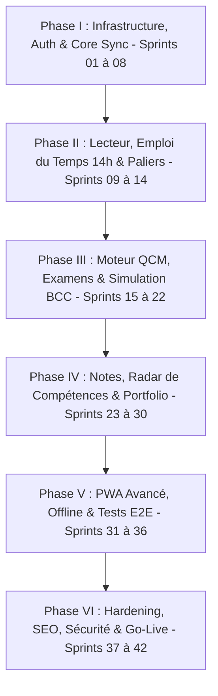

# PLAN DE DÉVELOPPEMENT MASTER — 42 SPRINTS GRANULAIRES
## Projet : Plateforme Web "Université Virtuelle PARADIS IT"
### Architecture : Docusaurus / MkDocs + JS + Supabase (Postgres/RLS/Storage) + Local-First (IndexedDB/PWA)

---

> [!IMPORTANT]
> **Charte de Gouvernance des Sprints** :
> 1. **Granularité Stricte** : Chaque sprint est conçu pour durer entre 1 et 3 jours maximum d'effort concentré. Aucun sprint ne doit être un "gros bloc".
> 2. **Règle du 1 Sprint = 1 Pull Request** : Chaque sprint fait l'objet d'une branche dédiée `feature/sprint-XX` et d'une validation QA avant fusion sur `main`.
> 3. **Règle Zéro Secret** : Aucun secret ou clé privée ne doit jamais être commité. Seules les variables d'environnement CI (`SUPABASE_URL`, `SUPABASE_ANON_KEY`) sont utilisées.
> 4. **Conformité Métier** : Alignement total sur les 45 jours (630h), les paliers d'employabilité (J3, J11, J28, J35, J45) et la préparation aux concours de la Banque Centrale du Congo (BCC).

---

## TABLE DES PHASES

---

## PHASE I : INFRASTRUCTURE, AUTHENTIFICATION & SYNC DE BASE (SPRINTS 01 À 08)

### 🔹 Sprint 01 — Injection des Secrets CI & Configuration Runtime
* **Objectif** : Sécuriser l'injection de `SUPABASE_URL` et `SUPABASE_ANON_KEY` dans le pipeline CI/CD GitHub Actions.
* **Tâches** :
  * Mettre à jour `.github/workflows/deploy.yml` pour générer le fichier de configuration au build.
  * Créer `site/js/supabase-config.js.template` et mettre à jour `.env.example`.
  * Ajouter un contrôle runtime empêchant l'exécution sans clé valide (sans fallback en dur).
* **Critères d'acceptation** : Build CI réussi avec les secrets ; zéro secret dans le dépôt Git.
* **Livrables** : PR Workflow GitHub Actions + Fichiers de configuration runtime.

### 🔹 Sprint 02 — Adapter de Stockage Local IndexedDB
* **Objectif** : Mettre en place le stockage local-first (`idb`) pour la persistance hors-ligne.
* **Tâches** :
  * Créer `js/storage-adapter.js` initialisant les stores `progress`, `notes`, `quiz_attempts`, `sync_queue`.
  * Écrire les méthodes CRUD basiques `saveLocal()`, `getLocal()`, `getAllLocal()`.
* **Critères d'acceptation** : Les données s'écrivent et se relisent dans l'IndexedDB du navigateur.
* **Livrables** : Module JS `storage-adapter.js` + Tests unitaires locaux.

### 🔹 Sprint 03 — Interface de Connexion & Inscription Supabase Auth
* **Objectif** : Offrir une modal/page de connexion et d'inscription (E-mail / Mot de passe & Google OAuth).
* **Tâches** :
  * Créer le composant UI Modal (`auth-modal.html` / JS).
  * Connecter les fonctions `ParadisSupabase.signUpWithPassword` et `signInWithPassword`.
  * Gérer les états d'erreur (mot de passe court, e-mail existant) et l'état de session connecté.
* **Critères d'acceptation** : L'utilisateur peut créer un compte, se connecter et voir son état de session.
* **Livrables** : UI Auth + Tests manuels de connexion.

### 🔹 Sprint 04 — Synchronisation du Profil & Fonction `ensureProfile`
* **Objectif** : Créer ou mettre à jour le profil de l'utilisateur dans la table `public.profiles`.
* **Tâches** :
  * Exécuter `ParadisSupabase.ensureProfile()` après chaque connexion réussie.
  * Créer le widget mini-profil dans le header (affichage du `display_name` et `avatar_url`).
* **Critères d'acceptation** : Une ligne est automatiquement créée dans `public.profiles` lors du premier login.
* **Livrables** : Widget header profil + intégration RPC Supabase.

### 🔹 Sprint 05 — Sauvegarde Locale de la Progression (Mode Hors-Ligne)
* **Objectif** : Permettre à l'utilisateur de marquer une journée comme complétée hors-ligne.
* **Tâches** :
  * Connecter le bouton "Marquer comme terminé" du jour à `ParadisProgress.saveProgress`.
  * Enregistrer la transaction locale dans IndexedDB avec un statut `synced: false`.
  * Afficher l'indicateur UI "Enregistré localement".
* **Critères d'acceptation** : Au rechargement sans réseau, la journée reste cochée.
* **Livrables** : Widget de progression mis à jour avec stockage local.

### 🔹 Sprint 06 — Bridge de Synchronisation Push (IndexedDB ➔ Supabase)
* **Objectif** : Déclencher la synchronisation automatique des données locales vers Supabase quand le réseau est disponible.
* **Tâches** :
  * Créer `js/sync-bridge.js` écoutant l'événement `window.online`.
  * Transmettre les éléments avec statut `synced: false` vers la table `public.progress`.
  * Implémenter l'algorithme de retry avec exponential backoff en cas d'échec.
* **Critères d'acceptation** : Les lignes de progression apparaissent dans Supabase et l'UI passe à "Synchronisé".
* **Livrables** : Bridge de synchronisation push opérationnel.

### 🔹 Sprint 07 — Engine de Synchronisation Pull & Fusion au Login
* **Objectif** : Télécharger la progression serveur et la fusionner avec le cache local lors de la connexion sur un nouvel appareil.
* **Tâches** :
  * Interroger `public.progress` au login (`ParadisProgress.loadProgressFromSupabase`).
  * Appliquer la règle de conflit : l'entrée serveur la plus récente (`updated_at`) l'emporte.
* **Critères d'acceptation** : En se connectant sur un 2ème PC, l'utilisateur retrouve toute sa progression.
* **Livrables** : Moteur de Pull & Merge fonctionnel.

### 🔹 Sprint 08 — Audit des Règles RLS & Vues à Moindre Privilège
* **Objectif** : Sécuriser la base Supabase en vérifiant que chaque utilisateur n'accès qu'à ses propres données.
* **Tâches** :
  * Revoir les politiques RLS sur `profiles`, `progress`, `notes`, `quiz_attempts`.
  * Créer la vue publique `public_profiles` (exposant uniquement `id`, `display_name`, `avatar_url`).
* **Critères d'acceptation** : Un utilisateur anonyme ne peut pas lire l'email des autres membres.
* **Livrables** : Script de migration SQL d'audit RLS.

---

## PHASE II : LECTEUR DE COURS, EMPLOI DU TEMPS 14H & PALIERS (SPRINTS 09 À 14)

### 🔹 Sprint 09 — Composant Lecteur de Leçons Markdown HD
* **Objectif** : Afficher les leçons du jour (J1 à J45) avec un rendu typographique irréprochable.
* **Tâches** :
  * Rendre les titres H1-H4, paragraphes, listes et blockquotes avec `Marked.js`.
  * Ajouter la prise en charge des callouts GitHub (`> [!NOTE]`, `> [!IMPORTANT]`, `> [!WARNING]`, `> [!TIP]`).
* **Critères d'acceptation** : Chaque jour s'affiche de manière claire, lisible et structurée.
* **Livrables** : Composant `lesson-reader.js` enrichi.

### 🔹 Sprint 10 — Coloration Syntaxique & Bouton Copier le Code
* **Objectif** : Styliser les blocs de code technique (Python, Bash, SQL, JS) et permettre leur copie en 1 clic.
* **Tâches** :
  * Intégrer `Prism.js` / `Highlight.js` avec thème sombre Obsidian.
  * Injecter le bouton "Copier" sur chaque bloc `<pre><code>`.
* **Critères d'acceptation** : Le code est coloré et le bouton copie le texte dans le presse-papier avec feedback visuel.
* **Livrables** : Plugin de code JS + CSS dédié.

### 🔹 Sprint 11 — Minuteur de Session 14h & Planning Quotidien
* **Objectif** : Visualiser le découpage temporel des 14h quotidiennes (2h Théorie, 8h Pratique, 2h Révision, 1h30 Quiz, 30m P1).
* **Tâches** :
  * Créer le widget interactif `schedule-timer-widget.js`.
  * Inclure un chrono de session configurable avec alarme/notification de fin de tranche horaire.
* **Critères d'acceptation** : L'apprenant peut lancer et suivre son temps d'étude quotidien.
* **Livrables** : Widget Minuteur 14h.

### 🔹 Sprint 12 — Cartes des Paliers d'Employabilité & Badges Métier
* **Objectif** : Afficher le déblocage visuel des compétences aux jours J3, J11, J28, J35 et J45.
* **Tâches** :
  * Créer le composant `milestones-widget.js`.
  * Animer le déblocage des badges (Technicien Support, Sysadmin, Spécialiste, Cloud Engineer, Candidate BCC).
* **Critères d'acceptation** : La complétion des jours débloque automatiquement les badges associés.
* **Livrables** : Widget des Paliers d'Employabilité.

### 🔹 Sprint 13 — Moteur de Recherche Plein Texte (Client-Side)
* **Objectif** : Offrir une recherche ultra-rapide (`Ctrl + K`) sur l'ensemble des 45 leçons et annexes.
* **Tâches** :
  * Générer ou charger l'index de recherche (`Fuse.js` / `Lunr.js`).
  * Créer la fenêtre modale de recherche rapide avec surlignage des résultats.
* **Critères d'acceptation** : Taper "systemctl" ou "VLOOKUP" renvoie instantanément les leçons correspondantes.
* **Livrables** : Composant de recherche `search-modal.js`.

### 🔹 Sprint 14 — Barre de Statut Synchro & Trigger de Force-Sync
* **Objectif** : Informer l'utilisateur sur l'état exact de la connexion et autoriser le déclenchement manuel de la synchro.
* **Tâches** :
  * Ajouter l'indicateur de statut (En ligne / Hors-ligne / Synchro en cours / Échec).
  * Ajouter le bouton "Forcer la synchronisation".
* **Critères d'acceptation** : L'utilisateur voit l'heure de la dernière synchro et peut forcer un rafraîchissement.
* **Livrables** : Barre d'état de synchronisation UI.

---

## PHASE III : MOTEUR DE QCM, EXAMENS BLANCS & SIMULATEUR BCC (SPRINTS 15 À 22)

### 🔹 Sprint 15 — Pipeline de Seeding des Questions QCM dans Supabase
* **Objectif** : Alimenter la table `public.qcm_questions` avec la banque globale de questions.
* **Tâches** :
  * Écrire le script Node.js / Python d'importation des questions QCM depuis les fichiers Markdown du Tome P5.
  * Valider l'insertion dans Supabase via le script de seed.
* **Critères d'acceptation** : Plus de 600 questions sont disponibles en base SQL avec leurs options et explications.
* **Livrables** : Script de seeding `scripts/seed-qcm.js`.

### 🔹 Sprint 16 — Interface de Passage de Quiz Quotidien
* **Objectif** : Permettre à l'apprenant d'effectuer le test QCM d'une journée.
* **Tâches** :
  * Créer la vue UI de quiz (`quiz-engine.js`).
  * Afficher les questions avec cartes interactives, sélection radio/checkbox et bouton "Valider mes réponses".
* **Critères d'acceptation** : L'utilisateur répond aux questions et obtient sa note calculée immédiatement sur 100.
* **Livrables** : Composant UI de Quiz interactif.

### 🔹 Sprint 17 — Persistance des Tentatives dans `public.qcm_attempts`
* **Objectif** : Enregistrer chaque tentative de QCM sur Supabase et dans le cache local.
* **Tâches** :
  * Créer la fonction `ParadisSupabase.saveAttempt()` effectuant un batch insert dans `qcm_attempts`.
  * Mettre à jour la moyenne de l'utilisateur et débloquer les leçons suivantes si score $\ge 75/100$.
* **Critères d'acceptation** : Les résultats de quiz sont stockés avec la date, le temps passé et le détail des réponses.
* **Livrables** : Moteur d'enregistrement des tentatives QCM.

### 🔹 Sprint 18 — Mode Examen Strict (Chrono 2h sans pause)
* **Objectif** : Créer l'expérience d'examen blanc en conditions réelles.
* **Tâches** :
  * Créer le module `exam-session.js`.
  * Initialiser la session dans `public.exam_sessions` avec l'horodatage `started_at`.
  * Bloquer la mise en pause et déclencher la soumission automatique à la fin du temps imparti (2h00).
* **Critères d'acceptation** : Le test se verrouille à 00:00 et soumet automatiquement les réponses.
* **Livrables** : Mode Examen Blanc Strict.

### 🔹 Sprint 19 — Module de Correction & Grille de Remédiation
* **Objectif** : Révéler les explications détaillées après la fin du test et recommander les révisions ciblées.
* **Tâches** :
  * Masquer les explications pendant le test ; les afficher uniquement après la soumission.
  * Si la note est $< 75/100$, afficher la liste d'exercices et de cours à relire.
* **Critères d'acceptation** : L'étudiant comprend exactement ses erreurs et sait quelles sections retravailler.
* **Livrables** : Vue de correction et remédiation.

### 🔹 Sprint 20 — Calcul des Scores Pondérés & Analytics par Domaine
* **Objectif** : Calculer les notes pondérées par niveau de difficulté et par tag d'ingénierie (Linux, SQL, Réseau, Cloud).
* **Tâches** :
  * Enrichir la logique de calcul de `quiz-engine.js` avec la formule du score weighted :
    $$\text{Score} = \frac{\sum (\text{Correction}_i \times \text{Poids}_i)}{\sum \text{Poids}_i} \times 100$$
  * Stocker les métriques par domaine dans la tentative.
* **Critères d'acceptation** : Chaque tentative produit un score global et un découpage par compétence.
* **Livrables** : Moteur de scoring analytique.

### 🔹 Sprint 21 — Simulateur d'Épreuve Spécifique Concours BCC
* **Objectif** : Créer le module d'entraînement dédié au concours de la Banque Centrale du Congo.
* **Tâches** :
  * Générer un tirage aléatoire de 100 questions parmi les thèmes IT, ITIL, ISO 27001, SWIFT, RTGS.
  * Appliquer l'interface dédiée "Épreuve Banque Centrale du Congo".
* **Critères d'acceptation** : Génération d'une épreuve unique de 100 questions au format concours d'État.
* **Livrables** : Module d'examen blanc BCC.

### 🔹 Sprint 22 — Vues SQL d'Analyse Statistiques de Difficulté des Questions
* **Objectif** : Créer les vues d'analyse SQL pour suivre le taux de réussite par question.
* **Tâches** :
  * Écrire la vue SQL `public.question_difficulty_stats`.
  * Permettre l'identification des questions les plus souvent manquées pour enrichir la banque de cours.
* **Critères d'acceptation** : La requête SQL renvoie le % d'erreur et le temps moyen passé par question.
* **Livrables** : Vues analytiques Postgres SQL.

---

## PHASE IV : NOTES, RADAR DE COMPÉTENCES, PORTFOLIO & BACKUPS (SPRINTS 23 À 30)

### 🔹 Sprint 23 — Éditeur de Notes Personnelles par Jour
* **Objectif** : Intégrer un bloc-notes Markdown sous chaque leçon pour enregistrer les remarques de l'apprenant.
* **Tâches** :
  * Créer le composant `notes-editor.js` (Textarea avec aperçu Markdown).
  * Auto-sauvegarder les notes dans IndexedDB et les synchroniser avec `public.notes`.
* **Critères d'acceptation** : Les notes rédigées sur un jour restent enregistrées et synchronisées multi-appareils.
* **Livrables** : Éditeur de notes interactif.

### 🔹 Sprint 24 — Calcul & Rendu du Radar de Compétences (Spider Chart)
* **Objectif** : Rendre le graphique radar 6 axes de progression de l'apprenant.
* **Tâches** :
  * Intégrer `Chart.js` ou SVG natif (`radar-chart.js`).
  * Appeler la fonction RPC Supabase `get_radar_scores(user_id)` pour alimenter les 6 axes.
* **Critères d'acceptation** : Le radar affiche visuellement l'équilibre des compétences acquises.
* **Livrables** : Composant Graphique Radar.

### 🔹 Sprint 25 — Configuration du Bucket Supabase Storage (`portfolio-artifacts`)
* **Objectif** : Permettre l'hébergement sécurisé des livrables de projets et captures du portfolio.
* **Tâches** :
  * Créer le bucket de stockage `portfolio-artifacts` dans Supabase.
  * Définir les politiques de sécurité (chaque utilisateur ne peut téléverser/supprimer que dans son dossier `/userId/`).
* **Critères d'acceptation** : Les fichiers ne sont accessibles qu'à leur propriétaire via des URLs signées ou publiques RLS.
* **Livrables** : Migration Bucket Supabase Storage + Politiques RLS.

### 🔹 Sprint 26 — Page Portfolio & Téléversement des Livrables de Projets (J42-J45)
* **Objectif** : Créer l'interface de gestion du portfolio de projets de fin d'étude.
* **Tâches** :
  * Créer la page `portfolio.html` avec formulaires d'ajout de lien GitHub et d'upload d'artefact PDF/Image.
  * Afficher la grille des 4 projets majeurs présentables en entretien.
* **Critères d'acceptation** : L'étudiant peut uploader la preuve de réalisation de ses projets J42 à J45.
* **Livrables** : Interface de gestion du Portfolio.

### 🔹 Sprint 27 — Moteur d'Export & Instantané de Sauvegarde (JSON Backup Snapshot)
* **Objectif** : Permettre à l’utilisateur de télécharger une sauvegarde complète de ses données en 1 clic.
* **Tâches** :
  * Créer la fonction `ParadisBackup.exportSnapshot()`.
  * Rassembler la progression, les notes et les scores dans un fichier JSON horodaté `paradis-backup-YYYY-MM-DD.json`.
* **Critères d'acceptation** : Le fichier JSON est téléchargé et contient l'intégralité de l'historique d'apprentissage.
* **Livrables** : Module d'export de sauvegarde JSON.

### 🔹 Sprint 28 — Politique de Rétention & Purge Automatique des Backups
* **Objectif** : Gérer les quotas de stockage et nettoyer les anciens snapshots obsolètes.
* **Tâches** :
  * Conserver automatiquement les 5 derniers snapshots par utilisateur.
  * Écrire le script de purge automatique.
* **Critères d'acceptation** : Les snapshots de plus de 30 jours au-delà du quota de 5 sont nettoyés sans impacter la progression active.
* **Livrables** : Script & Runbook de rétention.

### 🔹 Sprint 29 — Outils de Métriques & Administration Lecture Seule
* **Objectif** : Consulter l'activité globale et les statistiques de la plateforme.
* **Tâches** :
  * Créer la vue d'administration protégée (accessible uniquement avec le rôle admin/service_role).
  * Afficher le nombre d'utilisateurs actifs, les taux de complétion par tome et la moyenne aux examens.
* **Critères d'acceptation** : Visualisation globale des données de la plateforme sans fuite de clés secrètes.
* **Livrables** : Tableau de bord admin lecture seule.

### 🔹 Sprint 30 — Générateur de Rapport d'Employabilité & Certificat PDF
* **Objectif** : Exporter un rapport officiel au format PDF à présenter lors des recrutements ou entretiens à la BCC.
* **Tâches** :
  * Intégrer un moteur de rendu PDF (`jspdf` / `html2pdf.js`).
  * Formater le document : logo PARADIS IT, volume d'heures effectuées (630h), résultats aux examens, radar de compétences et projets du portfolio.
* **Critères d'acceptation** : Génération d'un document PDF élégant, imprimable et vérifiable.
* **Livrables** : Générateur de Rapport PDF.

---

## PHASE V : ADVANCED OFFLINE PWA, FIABILITÉ & CONFLITS (SPRINTS 31 À 36)

### 🔹 Sprint 31 — Configuration PWA & Manifest Web (`manifest.json`)
* **Objectif** : Rendre la plateforme installable sur ordinateur et mobile comme une application native.
* **Tâches** :
  * Créer `manifest.json` (icônes 192px/512px, thème sombre, mode standalone, orientation).
  * Référencer le manifest dans l'entête de toutes les pages.
* **Critères d'acceptation** : Le navigateur propose le bouton "Installer l'application PARADIS IT".
* **Livrables** : Manifest PWA + Icônes d'application.

### 🔹 Sprint 32 — Service Worker & Stratégie Cache-First pour les Actifs Statiques
* **Objectif** : Permettre le chargement instantané de la plateforme sans connexion réseau.
* **Tâches** :
  * Écrire `sw.js` pré-cachant le shell HTML, le CSS, le JS, les polices et la bannière.
  * Gérer les mises à jour de cache lors des nouvelles versions de la plateforme.
* **Critères d'acceptation** : En mode avion, la plateforme s'ouvre et s'affiche sans erreur 404.
* **Livrables** : Service Worker PWA complet.

### 🔹 Sprint 33 — Intégration de l'API Background Sync du Navigateur
* **Objectif** : Exécuter la synchronisation des données en arrière-plan dès le retour du réseau.
* **Tâches** :
  * Enregistrer le hook `sync` du Service Worker (`sync-progress-queue`).
  * Traiter la file d'attente des transactions même si l'onglet est fermé.
* **Critères d'acceptation** : Une note rédigée hors-ligne est envoyée au serveur dès la reconnexion automatique.
* **Livrables** : Background Sync Service Worker.

### 🔹 Sprint 34 — Algorithme Déterministe de Résolution de Conflits (3-Way Merge)
* **Objectif** : Gérer sans perte de données les cas où un utilisateur modifie ses notes simultanément sur deux appareils.
* **Tâches** :
  * Implémenter la logique de fusion déterministe dans `js/conflict-resolver.js` :
    - *Progression* : Last-Write-Wins (LWW) basé sur `updated_at`.
    - *Notes* : Fusion par paragraphe horodaté.
    - *Examens / QCM* : Autorité stricte du serveur.
* **Critères d'acceptation** : Aucun écrasement destructif des notes en cas de synchronisation différée.
* **Livrables** : Moteur de résolution de conflits.

### 🔹 Sprint 35 — Scénarios de Tests d'Intégration Transition Offline/Online
* **Objectif** : Valider la résilience du système face aux coupures réseau brutales.
* **Tâches** :
  * Écrire les scripts de simulation de déconnexion/reconnexion réseau.
  * Valider l'intégrité des données dans la file de synchronisation.
* **Critères d'acceptation** : 100% des transactions hors-ligne sont correctement rejouées à la reconnexion.
* **Livrables** : Suite de tests d'intégration offline.

### 🔹 Sprint 36 — Automation des Tests E2E avec Playwright en CI
* **Objectif** : Automatiser la vérification des parcours utilisateurs majeurs dans le pipeline GitHub Actions.
* **Tâches** :
  * Installer et configurer Playwright (`e2e/auth.spec.js`, `e2e/quiz.spec.js`, `e2e/progress.spec.js`).
  * Exécuter la suite de tests en mode headless dans la CI.
* **Critères d'acceptation** : Les tests E2E passent avec succès à chaque Pull Request.
* **Livrables** : Suite de tests E2E Playwright.

---

## PHASE VI : HARDENING, PERFORMANCE, SEO, SÉCURITÉ & GO-LIVE (SPRINTS 37 À 42)

### 🔹 Sprint 37 — Optimisation de Performance Core Web Vitals & Bundle
* **Objectif** : Obtenir un score Lighthouse de performance $> 90/100$.
* **Tâches** :
  * Minifier les scripts JS, le CSS et optimiser le chargement des polices Google Fonts (`font-display: swap`).
  * Réduire les temps de blocage au rendu (LCP $< 1.2$s, INP $< 80$ms).
* **Critères d'acceptation** : Rapport Lighthouse vert sur toutes les métriques de performance.
* **Livrables** : Rapport d'optimisation & correctifs de performance.

### 🔹 Sprint 38 — Audit d'Accessibilité WCAG 2.1 AA & Navigation Clavier
* **Objectif** : Rendre l'interface 100% accessible à tous les apprenants.
* **Tâches** :
  * Vérifier les ratios de contraste de la charte sombre Obsidian ($> 4.5:1$).
  * S'assurer que tous les éléments interactifs sont manipulables uniquement au clavier avec états de focus visuels.
  * Valider les balises `aria-label` et les rôles ARIA.
* **Critères d'acceptation** : Score d'accessibilité Lighthouse $= 100/100$.
* **Livrables** : Correctifs d'accessibilité WCAG.

### 🔹 Sprint 39 — Génération SEO, Sitemap.xml & Balises OpenGraph
* **Objectif** : Assurer un référencement optimal sur les moteurs de recherche pour faire connaître la plateforme.
* **Tâches** :
  * Générer automatiquement `sitemap.xml` et `robots.txt` lors du build.
  * Ajouter les méta-données OpenGraph (images de partage, titres, descriptions) sur chaque page.
* **Critères d'acceptation** : Le sitemap est valide et les aperçus lors du partage de lien s'affichent correctement.
* **Livrables** : Configuration & Générateur SEO.

### 🔹 Sprint 40 — Audit de Sécurité, Entêtes CSP & Verification anti-fuite de clés
* **Objectif** : Garantir la sécurité maximale de l'application web.
* **Tâches** :
  * Définir la politique de sécurité des contenus (Content Security Policy - CSP).
  * Exécuter un balayage de sécurité (`git-secrets` / `trufflehog`) pour s'assurer qu'aucun jeton n'a été commité.
  * Assainir les entrées HTML Markdown pour prévenir les failles XSS.
* **Critères d'acceptation** : Zéro vulnérabilité critique détectée, entêtes de sécurité en place.
* **Livrables** : Rapport d'audit de sécurité.

### 🔹 Sprint 41 — Monitoring de Production, Quotas & Manuel d'Exploitation (Runbook)
* **Objectif** : Préparer l'exploitation continue et la surveillance des ressources.
* **Tâches** :
  * Configurer les alertes de quotas Supabase (base de données, stockage, auth).
  * Écrire le manuel d'exploitation `00-cahier-des-charges/RUNBOOK-EXPLOITATION.md` (rotation des clés, procédures de restauration, gestion des incidents).
* **Critères d'acceptation** : Le manuel d'exploitation est rédigé et l'équipe sait gérer une procédure d'urgence.
* **Livrables** : Runbook d'exploitation.

### 🔹 Sprint 42 — Revue Finale de Recette, Documentation de Restitution & Go-Live
* **Objectif** : Effectuer la recette générale de la plateforme et prononcer le Go-Live officiel.
* **Tâches** :
  * Valider la checklist complète des 42 sprints.
  * Déployer la version finale sur GitHub Pages et basculer en mode production.
  * Rédiger la documentation finale de restitution.
* **Critères d'acceptation** : Plateforme 100% fonctionnelle, testée, sécurisée et accessible en ligne.
* **Livrables** : Procès-verbal de recette finale & Plateforme en production.

---

## RÉSUMÉ DU PLANNING & ESTIMATION

| Phase | Périmètre | Nombre de Sprints | Estimation Temps Cumulée |
| :--- | :--- | :--- | :--- |
| **Phase I** | Infra, Auth & Sync de Base | 8 Sprints (S01 - S08) | 12 à 16 jours ouvrés |
| **Phase II** | Lecteur, Timer 14h & Paliers | 6 Sprints (S09 - S14) | 9 à 12 jours ouvrés |
| **Phase III** | Moteur QCM & Simulateur BCC | 8 Sprints (S15 - S22) | 12 à 16 jours ouvrés |
| **Phase IV** | Notes, Radar & Portfolio | 8 Sprints (S23 - S30) | 12 à 16 jours ouvrés |
| **Phase V** | PWA Avancé & Tests E2E | 6 Sprints (S31 - S36) | 9 à 12 jours ouvrés |
| **Phase VI** | Hardening, SEO & Go-Live | 6 Sprints (S37 - S42) | 9 à 12 jours ouvrés |
| **TOTAL** | **42 Sprints Granulaires** | **42 Sprints** | **~60 à 84 jours d'effort** |
