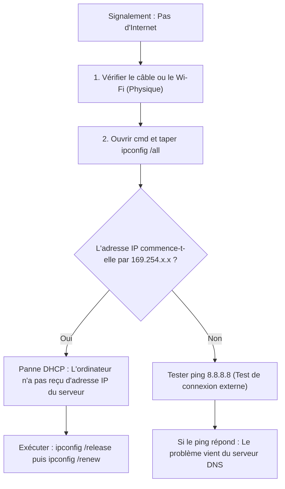

# TOME P0 — Jour 01 (14h) : Immersion Informatique & Fondations Système

> [!NOTE]
> **Objectif de la journée** : Ce cours est conçu pour vous si vous partez de zéro absolu. À la fin de cette journée, vous saurez comment fonctionne réellement un ordinateur, comment gérer les comptes et la sécurité sous Windows, maîtriser Excel et Word à un niveau professionnel d'entreprise, et résoudre les pannes de premier niveau.

---

## 1) Windows & L'Architecture Système en Environnement Professionnel (3h)

### 📖 1.1 Comprendre ce qu'est un Système d'Exploitation (OS)
Quand vous regardez un ordinateur, vous voyez un écran, un clavier et une souris. C'est ce qu'on appelle le **Hardware** (le matériel physique).

Mais le matériel tout seul ne sait rien faire. Si vous appuyez sur la touche "A", le clavier envoie simplement une petite impulsion électrique. C'est le **Système d'Exploitation** (Windows 11, Linux, macOS) qui reçoit ce signal électrique et le traduit sous forme d'une lettre "A" affichée à l'écran.

> [!TIP]
> **Le système d'exploitation est le traducteur universel** entre l'humain qui s'exprime avec des clics et des mots, et l'ordinateur qui ne comprend que le langage binaire (des 0 et des 1, c'est-à-dire du courant électrique).

---

### 🔍 1.2 Passer derrière le décor : Les 3 Niveaux de Contrôle de Windows

Un utilisateur ordinaire se contente de cliquer sur des icônes. En tant que futur professionnel IT d'une banque ou d'une entreprise, vous devez maîtriser les **3 portes d'entrée de Windows** :

#### Niveau 1 : L'application "Paramètres" (Grand Public)
- **C'est quoi ?** L'interface moderne simplifiée.
- **Accès rapide** : Raccourci `Touche Windows + I`.
- **À quoi ça sert ?** Régler le volume, changer le fond d'écran, se connecter au Wi-Fi.

#### Niveau 2 : Le Panneau de Configuration (Administration Classique)
- **C'est quoi ?** L'ancien centre de contrôle complet de Windows. Il donne accès à des réglages réseau et matériel très précis.
- **Accès rapide** :
  1. Appuyez sur `Windows + R` (cela ouvre la fenêtre d'exécution rapide).
  2. Tapez `control` puis validez avec `Entrée`.

#### Niveau 3 : La Console de Management MMC (`compmgmt.msc`)
- **C'est quoi ?** Le véritable tableau de bord d'un technicien informatique.
- **Accès rapide** : `Windows + R` ➔ tapez `compmgmt.msc` ➔ appuyez sur `Entrée`.
- **Ce qu'on y trouve** :
  - **Gestion des disques** : Voir la santé des cartes mémoire et disques durs.
  - **Services** : Voir et redémarrer les programmes invisibles en arrière-plan.
  - **Observateur d'événements** : Le journal qui enregistre toutes les erreurs système.

---

### 🛡️ 1.3 Gestion des Comptes Utilisateurs & Sécurité

Un ordinateur d'entreprise ne doit jamais être laissé en libre accès. Chaque employé possède son **compte utilisateur**.

#### Les deux types de comptes majeurs :
1. **Le Compte Standard** : Destiné au travail de tous les jours. L'utilisateur peut ouvrir ses logiciels et créer ses documents, mais **ne peut pas installer de logiciels ni modifier le système**.
2. **Le Compte Administrateur** : Utilisé uniquement par l'équipe informatique pour faire de la maintenance, installer des programmes ou réparer le système.

> [!IMPORTANT]
> **Règle d'or de la sécurité informatique (Le Moindre Privilège)** :
> Ne travaillez JAMAIS au quotidien sur un compte Administrateur. Si vous cliquez par erreur sur un piège ou un virus en navigant sur Internet, le virus prendrait immédiatement les droits Administrateur et détruirait tout l'ordinateur. En compte Standard, le virus est bloqué.

#### Atelier Pratique : Créer un compte utilisateur en Ligne de Commande
1. Ouvrez le menu Démarrer, tapez `cmd`.
2. Faites un **clic droit** sur *Invite de commandes* ➔ **Exécuter en tant qu'administrateur**.
3. Pour créer un utilisateur nommé `stagiaire` avec le mot de passe `Passer123!`, tapez :
   ```cmd
   net user stagiaire Passer123! /add
   ```
4. Pour vérifier que le compte est créé :
   ```cmd
   net user
   ```

---

### 🚑 1.4 Méthode de Dépannage Réseau & Support Client

Quand un utilisateur vous appelle en disant *"Mon ordinateur n'a plus Internet !"*, voici la méthode professionnelle à appliquer pas-à-pas :



#### Explication des commandes de diagnostic :
- `ipconfig` : Affiche l'adresse IP (la carte d'identité réseau) de votre ordinateur.
- `ping 8.8.8.8` : Envoie de petits paquets de données vers un serveur externe pour voir si le réseau fonctionne.

---

## 2) Microsoft Excel en Environnement Professionnel (4h)

### 📖 2.1 Les Fondations d'un Tableau de Données Pro

Excel n'est pas une simple grille pour faire des dessins ou des listes de courses. C'est une **base de données visuelle**.

#### Les règles d'or d'un tableau propre :
1. **Une ligne = Une seule information** (ex: un client, une transaction).
2. **Une colonne = Un seul type de donnée** (ex: Date, Nom, Montant).
3. **Jamais de cellules fusionnées** dans les lignes de données brutes (cela empêche les triages et les calculs automatiques).

---

### 🛠️ 2.2 Les Formules Incontournables expliquées simplement

Toute formule sous Excel commence TOUJOURS par le signe `=`.

#### 1. La formule `SI()` (Prendre une décision automatique)
- **À quoi ça sert ?** Demander à Excel d'écrire un résultat différent selon une condition.
- **Exemple** : Si la note est supérieure ou égale à 10, afficher "Admis", sinon "Ajourné".
- **Syntaxe** :
  ```excel
  =SI(A2>=10; "Admis"; "Ajourné")
  ```

#### 2. La formule `RECHERCHEV()` ou `XLOOKUP()` (Retrouver une information)
- **À quoi ça sert ?** Chercher un numéro de compte bancaire ou un matricule dans un grand fichier et afficher le nom du client correspondant automatiquement.
- **Syntaxe simple** :
  ```excel
  =RECHERCHEV(MatriculeCherché; TableauDeRecherche; NuméroColonneNom; FAUX)
  ```

---

### 📊 2.3 Les Tableaux Croisés Dynamiques (TCD)

- **C'est quoi ?** Un outil magique sous Excel qui permet de résumer des milliers de lignes en un petit tableau de synthèse en 3 clics.
- **Comment le créer ?**
  1. Cliquez n'importe où dans votre tableau de données.
  2. Allez dans le menu **Insertion** ➔ **Tableau croisé dynamique**.
  3. Glissez-déposez les champs (ex: mettre *Services* en Lignes et *Montant* en Valeurs).

---

## 3) Word, PowerPoint & Communication Professionnelle (3h)

### 📄 3.1 Word : Structuration avec les Styles
Pour rédiger un rapport professionnel de niveau banque ou direction :
- N'utilisez pas la mise en forme manuelle (changer la taille de police à la main).
- Utilisez les **Styles** (**Titre 1**, **Titre 2**, **Corps de texte**).
- **Avantage** : Permet de générer une **Table des matières automatique** en 1 clic (Menu *Références* ➔ *Table des matières*).

---

## 🏋️ Exercices Pratiques & Corrigés

### Exercice 1 : Administration Système
Créer un utilisateur nommé `agent.bcc` en ligne de commande et vérifier ses informations.
- **Corrigé** :
  1. Ouvrir `cmd` en administrateur.
  2. Tapez `net user agent.bcc MotDePasse2026! /add`.
  3. Tapez `net user agent.bcc` pour afficher les détails du compte.

### Exercice 2 : Calcul Excel Automatisé
Dans un tableau comportant le montant de 5 factures en colonne A, écrivez la formule pour afficher "Plafond Dépassé" si le montant dépasse 1 000 $, sinon "Conforme".
- **Corrigé** :
  ```excel
  =SI(A2>1000; "Plafond Dépassé"; "Conforme")
  ```

---

## ❓ Banque de Questions du Jour (Auto-Évaluation)

1. **QCM** : Quel raccourci permet d'ouvrir la fenêtre d'exécution sous Windows ?
   - A. `Ctrl + Alt + Suppr`
   - B. `Windows + R` ✅
   - C. `Windows + E`

2. **QCM** : Quelle est la meilleure pratique de sécurité pour les comptes utilisateurs ?
   - A. Utiliser le compte Administrateur pour tout faire
   - B. Utiliser un compte Standard au quotidien ✅
   - C. Ne pas mettre de mot de passe

3. **Question Ouverte** : Que signifie une adresse IP qui commence par `169.254.x.x` ?
   - *Réponse* : C'est une adresse APIPA. Cela indique que l'ordinateur n'a pas réussi à contacter le serveur DHCP pour recevoir une vraie adresse réseau.
