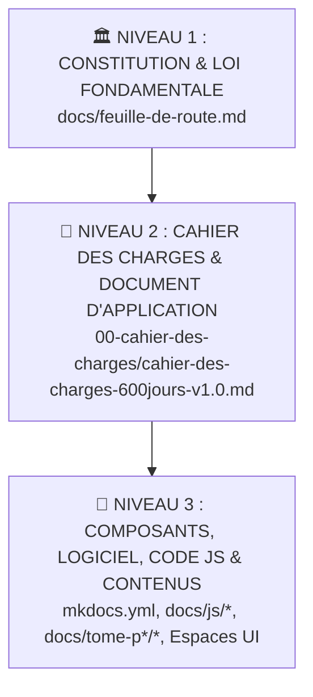

# 🏛️ CONSTITUTION ET LOI FONDAMENTALE — PARADIS IT MASTERCLASS
## Version 6.0 — Référentiel Ultime 600 Jours (Août 2026)

---

> ### 📜 PRÉAMBULE CONSTITUTIONNEL
> La présente **Feuille de Route Ultime** constitue la **Constitution et la Loi Fondamentale** de la plateforme **PARADIS IT Masterclass**.
> Elle établit les principes éthiques, pédagogiques, méthodologiques et architecturaux inviolables qui régissent l'ensemble du parcours d'autoformation, de la première leçon du Semestre 1 jusqu'à la certification finale d'Architecte Master IT du Semestre 12.
>
> Elle a pour vocation de garantir l'excellence académique, l'autonomie souveraine de l'apprenant, la pérennité des acquis et la soutenabilité de l'effort sur un rythme professionnellement réaliste de **5 à 6 heures d'apprentissage quotidien sur 600 jours (3 300 heures au total)**.

---

## ⚖️ ARTICLE 1 : SUPRÉMATIE CONSTITUTIONNELLE ET HIERARCHIE DES NORMES

### Section 1.01 — Clause de Suprématie Absolue
La présente **Constitution (Feuille de Route)** est la **norme suprême et la loi fondamentale** de toute la plateforme **PARADIS IT Masterclass**.

> [!IMPORTANT]
> **CLAUSE DE SUPRÉMATIE ET D'ALIGNEMENT OBLIGATOIRE :**  
> **Tous les composants de la plateforme — sans aucune exception — doivent strictement respecter la présente Constitution et s'y conformer intégralement.**  
> Cela inclut notamment :
> 1. Le **Cahier des Charges** (`00-cahier-des-charges/cahier-des-charges-600jours-v1.0.md`), qui constitue le document d'application et d'explication de la mise en pratique technique de cette Constitution.
> 2. Tous les **modules et scripts JavaScript** (`docs/js/*`) de l'infrastructure logicielle.
> 3. La configuration de navigation et de déploiement MkDocs (`mkdocs.yml`).
> 4. L'ensemble des **600 leçons et 12 tomes pédagogiques** (`docs/tome-p*/*`).
> 5. Tous les **espaces fonctionnels UI** (Espace Étudiant, Espace Évaluation, Radar de Compétences, Portfolio Builder, Tuteur IA, QCM, Examen Blanc).
>
> **Toute spécification, code, module ou texte qui entrerait en contradiction avec les dispositions de cette Constitution est réputé nul, invalide et immédiatement soumis à rectification.**

### Section 1.02 — Hiérarchie des Normes PARADIS IT

---

## ⏱️ ARTICLE 2 : CADENCEMENT ET REGIME DE FORMATION (600 JOURS / 3 300H)

### Section 2.01 — Durée et Rythme Quotidien Soutenable
1. Le cursus complet s'étend sur une durée exacte de **600 jours d'autoformation guidée**.
2. Le temps de travail quotidien recommandé et calibré est de **5 à 6 heures par jour**, décomposé ainsi :
   - 📖 **1h30 à 2h00** : Théorie fondamentale, concepts et architecture.
   - 💻 **2h30 à 3h00** : Travaux pratiques, scripts Bash/Python, manipulation de labs et lignes de commande.
   - 🧪 **1h00** : Évaluation quotidienne QCM, révision et compagnonnage avec le Tuteur IA.
3. Le volume horaire total de la Masterclass s'élève à **3 300 heures d'apprentissage pratique**.

### Section 2.02 — Structure en 12 Semestres Progressifs (S1 à S12)
Chaque semestre comprend exactement **50 leçons quotidiennes (275 heures de formation)** :

| Semestre | Tome | Jours | Thématique Principale | Volume | Jalon & Certification Cible |
| :---: | :---: | :---: | :--- | :---: | :--- |
| **S1** | **P0** | J001–J050 | Fondamentaux Linux, Shell Bash & Administration Systèmes | 275 h | Linux Essentials / LPIC-1 |
| **S2** | **P2** | J051–J100 | Réseaux & Télécoms Avancés (BGP, OSPF, SDN, Wireshark) | 275 h | CCNA / Network+ |
| **S3** | **P3** | J101–J150 | Virtualisation Enterprise (Proxmox/KVM) & Stockage Ceph/SAN | 275 h | Proxmox VE / VCP |
| **S4** | **P4** | J151–J200 | Cloud Computing AWS/Azure & Infrastructures as Code (Terraform) | 275 h | AWS SysOps / Terraform Associate |
| **S5** | **P5** | J201–J250 | Conteneurs Docker, Kubernetes Avancé & GitOps (ArgoCD) | 275 h | CKA (Certified Kubernetes Admin) |
| **S6** | **P6** | J251–J300 | Pentesting, Active Directory Offensif & Red Team Operations | 275 h | OSCP+ / CEH Master |
| **S7** | **P7** | J301–J350 | Application Security, OWASP Top 10, DevSecOps & API Security | 275 h | CKS (Certified K8s Security) |
| **S8** | **P8** | J351–J400 | Hardening OS, IAM, PAM, EDR/XDR, SIEM & SOC Blue Team | 275 h | CISSP / Security+ |
| **S9** | **P9** | J401–J450 | Cryptographie Avancée, PKI Enterprise, ZKP & Post-Quantique (PQC) | 275 h | PQC Specialist / ECIH |
| **S10** | **P10** | J451–J500 | DFIR, Volatility 3, Ghidra & Reverse Engineering Malware | 275 h | GCFA / GREM |
| **S11** | **P11** | J501–J550 | IA/ML, MLOps, LLM Red Teaming & AI Security (MITRE ATLAS) | 275 h | DevSecOps / AI Security Professional |
| **S12** | **P12** | J551–J600 | Gouvernance GRC ISO 27001, Architecture Zero-Trust & Capstone Master | 275 h | CISO / CISM / **Grand Capstone Final** |

---

## 🔒 ARTICLE 3 : INVIOLABILITÉ ET PRÉSERVATION DU SOCLE D'ORIGINE

### Section 3.01 — Protection du Semestre 1 Initial (`docs/tome-p0/`)
1. Le **Semestre 1 initial (J1 à J50 - Fondamentaux Linux & Administration Systèmes)** est sanctuarisé.
2. L'ensemble des 50 leçons d'origine (`jour-01.md` à `jour-50.md`) demeure **100% intact, complet et inviolable**.
3. Aucune mise à jour de la plateforme ne peut supprimer, tronquer ou altérer les cours du Semestre 1, qui constituent la pierre angulaire de la formation.

---

## 🎯 ARTICLE 4 : RÉGIME ÉVALUATIF ET CERTIFICATIONS

### Section 4.01 — Évaluations Quotidiennes
Chaque jour de formation se conclut par une évaluation QCM interrogeant les compétences du jour. Le passage à la journée suivante requiert une note minimale de **70/100**.

### Section 4.02 — Examens de Semestre et Grand Examen Blanc
1. À la fin de chaque semestre (tous les 50 jours), un examen de synthèse semestriel valide les acquis du semestre.
2. Le cursus se termine au Jour 600 par le **Grand Examen Blanc Masterclass (600 questions chrono 2h)** couvrant l'intégralité des 12 semestres.

### Section 4.03 — Capstones & Certifications Digitales
La validation des 12 semestres et du Grand Capstone d'Architecture Zero-Trust confère le **Diplôme d'Architecte Master IT PARADIS**, certifié de manière inaltérable via identifiant unique.

---

## 💻 ARTICLE 5 : GOUVERNANCE TECHNOLOGIQUE & LOCAL-FIRST

### Section 5.01 — Architecture Local-First et Gratuité
1. La plateforme doit garantir un fonctionnement **100% hors-ligne (Local-First)** via PWA (Progressive Web App) et stockage local IndexedDB.
2. Aucune dépendance envers des services payants ne peut être imposée à l'apprenant.

### Section 5.02 — Accompagnement IA Socratique
Le Tuteur IA (propulsé par Google Gemini / DeepSeek) agit en compagnon pédagogique socratique : il guide la réflexion de l'apprenant sans donner de réponses brutes pré-machées.

---

## 📜 ARTICLE 6 : CLAUSE DE REVISION ET D'EXECUTION

1. Toute modification du présent document exige un audit de conformité global vérifiant qu'aucun composant sous-jacent n'est rendu obsolète ou contradictoire.
2. La présente Constitution entre en vigueur immédiatement dès sa publication sur la branche `main` du dépôt.

---

*Constitution promulguée et mise en application le 13 Août 2026 — PARADIS IT Masterclass v6.0*
